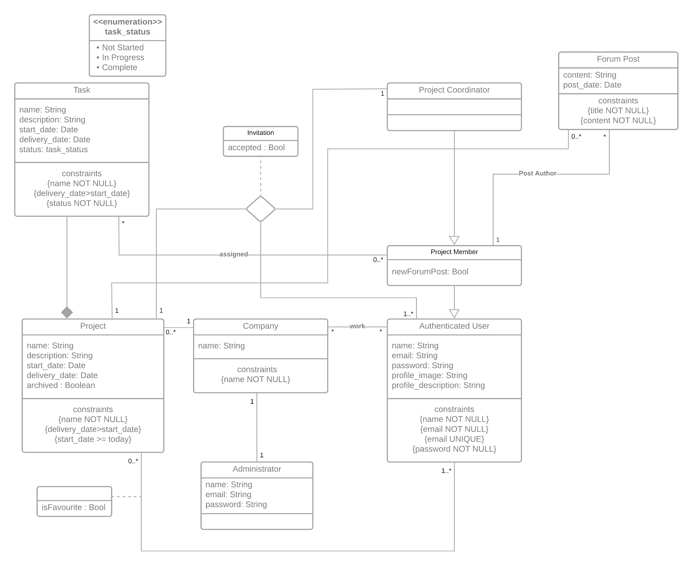

# EBD: Database Specification Component

This project aims to build an information system with a web interface for project management that allows teams of users to organize their professional projects. This application’s target audience are companies and teams working on complex projects, offering them a platform to organize every aspect of their workflow.

## A4: Conceptual Data Model

A professional diagram drawing tool that supports UML is recommended.

### 1. Class diagram

The Conceptual Domain Model contains the identification and description of the entities of the domain and the relationships between them in a UML class diagram.

The following diagram represents the main organizational entities, the relationships between them, attributes, and the multiplicity of relationships for our website.



### 2. Additional Business Rules

- Only the post's author can generate new Post Editions
- A user can't have more than 5 favorite projects

## A5: Relational Schema, validation and schema refinement

### 1. Relational Schema

Relation schemas are specified in the compact notation:

| Relation reference | Relation Compact Notation                                                                                                                                     |
| ------------------ | ------------------------------------------------------------------------------------------------------------------------------------------------------------- |
| R01                | user(id **PK**,email **UK NN**,name **NN**,password **NN**, profile_image, profile_description)                                                               |
| R02                | company(id **PK**,name **NN**)                                                                                                                                |
| R03                | administrator(email **PK**,name **NN**,company_id **NN**)                                                                                                     |
| R04                | work(user_id **PK**,**company id**)                                                                                                                           |
| R05                | project(id **PK**, company_id **FK**,name **NN**, description, start_date **NN**, delivery_date **NN** **CK** delivery_date>start_date, archived)             |
| R06                | project_coordinator(user_id **PK**,project_id**PK**)                                                                                                          |
| R07                | project_member(user_id **PK**,company_id**PK**,seenNewForumPost **NN**)                                                                                       |
| R08                | task(id **PK**, project_id, name **NN**, description, start_date **NN**, delivery_date NN CK -> delivery > start, status **NN** **CK** status IN task_status) |
| R09                | task_assigned(project_coordinator_id **PK**, project_member_id **PK**,task_id **PK**,notified)                                                                |
| R10                | forum_post(id **PK**,project_id,project_member_id **NN**, content **NN**, post_date **NN**, deleted **NN**)                                                   |
| R11                | invitation(project_id **PK** ,user_id **PK**,coordinator_id **PK**, accepted **NN**)                                                                          |
| R12                | favorite(**project_id**, **user_id**)                                                                                                                         |
| R13                | post_edition(**id**,forum_post_id,edit_date **NN**, content **NN**)                                                                                           |

**Legend:**

**PK** = PRIMATY KEY

**UK** = UNIQUE KEY

**FK** = FOREIGN KEY

**NN** = NOT NULL

**CK** = CHECK.

### 2. Domains

Specification of additional domains:

| Domain Name | Domain Specification                           |
| ----------- | ---------------------------------------------- |
| task_status | ENUM('Not Started', 'In Progress', 'Complete') |

### 3. Schema validation

To validate the Relational Schema obtained from the Conceptual Data Model, all functional dependencies are identified and the normalization of all relation schemas is accomplished.

| **TABLE R01**               | user                                                             |
| --------------------------- | ---------------------------------------------------------------- |
| **Keys**                    | { id }, { email }                                                |
| **Functional Dependencies** |                                                                  |
| FD0101                      | id → {email, name, password, profile_image, profile_description} |
| FD0102                      | email → {id, name, password, profile_image, profile_description} |
| **NORMAL FORM**             | BCNF                                                             |

| **TABLE R02**               | company     |
| --------------------------- | ----------- |
| **Keys**                    | { id }      |
| **Functional Dependencies** |             |
| FD0101                      | id → {name} |
| **NORMAL FORM**             | BCNF        |

| **TABLE R03**               | administrator             |
| --------------------------- | ------------------------- |
| **Keys**                    | { email }                 |
| **Functional Dependencies** |                           |
| FD0101                      | email → {name,company_id} |
| **NORMAL FORM**             | BCNF                      |

| **TABLE R04**               | work                    |
| --------------------------- | ----------------------- |
| **Keys**                    | { user_id, company_id } |
| **Functional Dependencies** |                         |
| FD0101                      | _none_                  |
| **NORMAL FORM**             | BCNF                    |

| **TABLE R05**               | project                                                                   |
| --------------------------- | ------------------------------------------------------------------------- |
| **Keys**                    | {id }                                                                     |
| **Functional Dependencies** |                                                                           |
| FD0101                      | id → {company_id, name, description, start_date, delivery_date, archived} |
| **NORMAL FORM**             | BCNF                                                                      |

| **TABLE R06**               | project_coordinator     |
| --------------------------- | ----------------------- |
| **Keys**                    | { user_id, project_id } |
| **Functional Dependencies** |                         |
| FD0101                      | _none_                  |
| **NORMAL FORM**             | BCNF                    |

| **TABLE R07**               | project_member                                |
| --------------------------- | --------------------------------------------- |
| **Keys**                    | { user_id, project_id }                       |
| **Functional Dependencies** |                                               |
| FD0101                      | { user_id, project_id } -> {seenNewForumPost} |
| **NORMAL FORM**             | BCNF                                          |

| **TABLE R08**               | task                                                                   |
| --------------------------- | ---------------------------------------------------------------------- |
| **Keys**                    | {id}                                                                   |
| **Functional Dependencies** |                                                                        |
| FD0101                      | id->{project_id, name, description, start_date, delivery_date, status} |
| **NORMAL FORM**             | BCNF                                                                   |

| **TABLE R09**               | task_assigned                                                    |
| --------------------------- | ---------------------------------------------------------------- |
| **Keys**                    | {project_coordinator_id, project_member_id, task_id}             |
| **Functional Dependencies** |                                                                  |
| FD0101                      | {project_coordinator_id, project_member_id, task_id}->{notified} |
| **NORMAL FORM**             | BCNF                                                             |

| **TABLE R10**               | forum_post                                                       |
| --------------------------- | ---------------------------------------------------------------- |
| **Keys**                    | {id}                                                             |
| **Functional Dependencies** |                                                                  |
| FD0101                      | id->{project_id, project_member_id, content, post_date, deleted} |
| **NORMAL FORM**             | BCNF                                                             |

| **TABLE R11**               | invitation                                         |
| --------------------------- | -------------------------------------------------- |
| **Keys**                    | {project_id, user_id, coordinator_id}              |
| **Functional Dependencies** |                                                    |
| FD0101                      | {project_id, user_id, coordinator_id} ->{accepted} |
| **NORMAL FORM**             | BCNF                                               |

| **TABLE R12**               | favorite             |
| --------------------------- | -------------------- |
| **Keys**                    | {user_id,project_id} |
| **Functional Dependencies** |                      |
| FD0101                      | _none_               |
| **NORMAL FORM**             | BCNF                 |

| **TABLE R13**               | post_edition                            |
| --------------------------- | --------------------------------------- |
| **Keys**                    | {id}                                    |
| **Functional Dependencies** |                                         |
| FD0101                      | id->{forum_post_id, edit_date, content} |
| **NORMAL FORM**             | BCNF                                    |

Because all relations are in the Boyce–Codd Normal Form (BCNF), the relational schema is also in the BCNF and, therefore, the schema does not need to be further normalized.

## A6: Indexes, triggers, transactions and database population

This artefact contains the database's workload, the physical schema of the database, its indexes, its triggers, the definition of some functions and transactions needed to assure the integrity of the data.
Besides all this, it also includes a link to the complete database creation script, including indexes and triggers.

### 1. Database Workload

It's essential to grasp the nature of the workload for the application and the performance objectives to develop a good database design. The workload includes an estimate of the number of tuples for each relation and also the estimated growth.

| **Relation reference** | **Relation Name**   | **Order of magnitude**       | **Estimated growth**   |
| ---------------------- | ------------------- | ---------------------------- | ---------------------- |
| R01                    | user                | 10k (tens of thousands)      | 10 (tens) / day        |
| R02                    | company             | 100 (hundreds)               | 1 (units) / day        |
| R03                    | administrator       | 100                          | 1 / day                |
| R04                    | work                | 10k                          | 10 / day               |
| R05                    | project             | 1k (thousands)               | 1 / day                |
| R06                    | project_coordinator | 1k                           | 1 / day                |
| R07                    | project_member      | 10k                          | 10 / day               |
| R08                    | task                | 100k (hundreds of thousands) | 100 (hundreds) / day   |
| R09                    | task_assigned       | 100k                         | 100 / day              |
| R10                    | forum_post          | 1kk (millions)               | 1000 (thousands) / day |
| R11                    | invitation          | 10k                          | 10 / day               |
| R12                    | favorite            | 1k                           | 1 / day                |
| R13                    | post_edition        | 100k                         | 100 (hundreds)/ day    |

### 2. Proposed Indexes

An index is used for looking something up in a table or any identical structure. This, however. takes extra memory since they are stored in memory and extra time when changing the table as the index needs to be updated as well

#### 2.1. Performance Indexes

| **Index**         | IDX01                                                                                                                                                                                                                                                                                                                                                                                                                                                                                                                                                                                                                                                                                                             |
| ----------------- | ----------------------------------------------------------------------------------------------------------------------------------------------------------------------------------------------------------------------------------------------------------------------------------------------------------------------------------------------------------------------------------------------------------------------------------------------------------------------------------------------------------------------------------------------------------------------------------------------------------------------------------------------------------------------------------------------------------------- |
| **Relation**      | project_member                                                                                                                                                                                                                                                                                                                                                                                                                                                                                                                                                                                                                                                                                                    |
| **Attribute**     | user_id                                                                                                                                                                                                                                                                                                                                                                                                                                                                                                                                                                                                                                                                                                           |
| **Type**          | B-tree                                                                                                                                                                                                                                                                                                                                                                                                                                                                                                                                                                                                                                                                                                            |
| **Cardinality**   | Medium                                                                                                                                                                                                                                                                                                                                                                                                                                                                                                                                                                                                                                                                                                            |
| **Clustering**    | Yes                                                                                                                                                                                                                                                                                                                                                                                                                                                                                                                                                                                                                                                                                                               |
| **Justification** | Table 'project_member' is large. Not large enough to justify an index just by its sheer size, but a very common query needs to filter every project by a certain member, so those two conditions justify an index. Since its cardinality is medium (due to multiple tuples having the same user_id -> high cardinality means to having mostly unique elements and low cardinality means having many repetead values) and update frequency isn't high, it's a good candidate for clustering. Clustering can't be used on hash type indexes, so a B-tree type index was opted for. The B-tree is the default index type and is used for exact matches or elements that have a greater or less than a certain value. |

```sql
CREATE INDEX project_member_user_index ON project_member USING btree (users_id); CLUSTER project_member USING project_member_user_index;
```

| **Index**         | IDX02                                                                                                                                                                                                                                                                                                                                                                                                                              |
| ----------------- | ---------------------------------------------------------------------------------------------------------------------------------------------------------------------------------------------------------------------------------------------------------------------------------------------------------------------------------------------------------------------------------------------------------------------------------- |
| **Relation**      | project_member                                                                                                                                                                                                                                                                                                                                                                                                                     |
| **Attribute**     | project_id                                                                                                                                                                                                                                                                                                                                                                                                                         |
| **Type**          | Hash                                                                                                                                                                                                                                                                                                                                                                                                                             |
| **Cardinality**   | Medium                                                                                                                                                                                                                                                                                                                                                                                                                             |
| **Clustering**    | No                                                                                                                                                                                                                                                                                                                                                                                                                                 |
| **Justification** | Table 'project_member' is large. Not large enough to justify an index just by its sheer size, but a very common query needs to filter every member of a certain project, so those two conditions justify an index. Despite its medium cardinality (due to multiple tuples having the same project_id) and medium update frequency, it's not a good candidate for clustering because the table is already clustered around user_id. For this, is will be used a hash index type where filtering is done by exact match, thus an hash type is best suited.  |
                                                                                                                                                       
```sql
CREATE INDEX project_member_project_index ON project_member USING hash(project_id);
```

| **Index**         | IDX03                                                                                                                                                                                                                                                                                                                                                                                                                                               |
| ----------------- | --------------------------------------------------------------------------------------------------------------------------------------------------------------------------------------------------------------------------------------------------------------------------------------------------------------------------------------------------------------------------------------------------------------------------------------------------- |
| **Relation**      | task_assigned                                                                                                                                                                                                                                                                                                                                                                                                                                       |
| **Attribute**     | project_member_id                                                                                                                                                                                                                                                                                                                                                                                                                                   |
| **Type**          | B-tree                                                                                                                                                                                                                                                                                                                                                                                                                                              |
| **Cardinality**   | Medium                                                                                                                                                                                                                                                                                                                                                                                                                                              |
| **Clustering**    | No                                                                                                                                                                                                                                                                                                                                                                                                                                                  |
| **Justification** | Table 'task_assigned' is very large and a very common query needs to filter every project assigned to a project member, so an index is necessary. Despite its medium cardinality (due to multiple tuples having the same project_member_id) and medium update frequency, it's not a good candidate for clustering. Clustering uses a lot of resources so it can take a lot of time, specially in this case where the tuple in question is so large. |

```sql
CREATE INDEX task_assigned_member_index ON task_assigned USING btree (project_member_id);
```

#### 2.2. Full-text Search Indixes

Full-Text Search Indexes are used when looking for full text. For each column wished to index for Full-Text Search you need to create a new column with auxiliary values for SQL algorithms to use.

| **Index**         | IDX04                                                                                                                                                                                                                      |
| ----------------- | -------------------------------------------------------------------------------------------------------------------------------------------------------------------------------------------------------------------------- |
| **Relation**      | forum_post                                                                                                                                                                                                                 |
| **Attribute**     | content                                                                                                                                                                                                                    |
| **Type**          | GIN                                                                                                                                                                                                                        |
| **Clustering**    | No                                                                                                                                                                                                                         |
| **Justification** | Used for improving the performance of full text search while searching for a specific term in of the biggest table of the database, 'task'. GIN was used because a task's name and description are not updated frequently. |

```sql
ALTER TABLE task
ADD COLUMN tsvectors TSVECTOR;

CREATE FUNCTION task_search_update() RETURNS TRIGGER AS $$
BEGIN
IF TG_OP = 'INSERT' THEN
       NEW.tsvectors = (
        setweight(to_tsvector('english', NEW.name), 'A') ||
        setweight(to_tsvector('english', NEW.description), 'B')
       );
END IF;
IF TG_OP = 'UPDATE' THEN
        IF (NEW.name <> OLD.name OR NEW.description <> OLD.description) THEN
          NEW.tsvectors = (
            setweight(to_tsvector('english', NEW.name), 'A') ||
            setweight(to_tsvector('english', NEW.description), 'B')
          );
        END IF;
END IF;
RETURN NEW;
END $$
LANGUAGE plpgsql;

CREATE TRIGGER task_search_update
BEFORE INSERT OR UPDATE ON task
FOR EACH ROW
EXECUTE PROCEDURE task_search_update();
```

### 3. Triggers

User-defined functions and trigger procedures that add control structures to the SQL language or perform complex computations, are identified and described to be trusted by the database server. Every kind of function (SQL functions, Stored procedures, Trigger procedures) can take base types, composite types, or combinations of these as arguments (parameters). In addition, every kind of function can return a base type or a composite type. Functions can also be defined to return sets of base or composite values.

| **Trigger**     | TRIGGER01                                        |
| --------------- | ------------------------------------------------ |
| **Description** | A user cannot have more than 5 favorite projects |

```sql
CREATE FUNCTION add_favorite() RETURNS TRIGGER AS
$BODY$
BEGIN
IF ((SELECT COUNT(*) FROM favorite WHERE NEW.users_id = users_id)=5) THEN
RAISE EXCEPTION 'A user cant have more than 5 favorite projects';
END IF;
RETURN NEW;
END
$BODY$
LANGUAGE plpgsql;

CREATE TRIGGER add_favorite
BEFORE INSERT OR UPDATE ON favorite
FOR EACH ROW
EXECUTE PROCEDURE add_favorite();
```

| **Trigger**     | TRIGGER02                                                                   |
| --------------- | --------------------------------------------------------------------------- |
| **Description** | When a project is archived, it is removed from the users' favorite projects |

```sql
CREATE FUNCTION remove_favorites() RETURNS TRIGGER AS
$BODY$
BEGIN
IF (NEW.archived=TRUE) THEN
DELETE FROM favorite WHERE NEW.id = project_id;
END IF;
RETURN NEW;
END
$BODY$
LANGUAGE plpgsql;

CREATE TRIGGER remove_favorites
BEFORE UPDATE ON project
FOR EACH ROW
EXECUTE PROCEDURE remove_favorites();
```

| **Trigger**     | TRIGGER03                                                             |
| --------------- | --------------------------------------------------------------------- |
| **Description** | Changing the content of a forum post creates a new Post Edition entry |

```sql
CREATE FUNCTION add_edit() RETURNS TRIGGER AS
$BODY$
BEGIN
IF (NEW.content!=OLD.content) THEN
INSERT INTO post_edition VALUES(DEFAULT,OLD.id,DEFAULT,OLD.content);
END IF;
RETURN NEW;
END
$BODY$
LANGUAGE plpgsql;

CREATE TRIGGER add_edit
BEFORE UPDATE ON forum_post
FOR EACH ROW
EXECUTE PROCEDURE add_edit();
```

### 4. Transactions

> Transactions needed to assure the integrity of the data.

| SQL Reference       | Transaction Name                    |
| ------------------- | ----------------------------------- |
| Justification       | Justification for the transaction.  |
| Isolation level     | Isolation level of the transaction. |
| `Complete SQL Code` |                                     |

## Annex A. SQL Code

> The database scripts are included in this annex to the EBD component.
>
> The database creation script and the population script should be presented as separate elements.
> The creation script includes the code necessary to build (and rebuild) the database.
> The population script includes an amount of tuples suitable for testing and with plausible values for the fields of the database.
>
> This code should also be included in the group's git repository and links added here.

### A.1. Database schema

### A.2. Database population

---

## Revision history

Changes made to the first submission:

1. Item 1
1. ..

---

GROUP2151, 08/11/2021

| Name           | Number    | E-Mail            |
| -------------- | --------- | ----------------- |
| Sofia Germer   | 201907461 | up201907461@up.pt |
| Miguel Lopes   | 201704590 | up201704590@up.pt |
| Edgar Torre    | 201906573 | up201906573@up.pt |
| Henrique Pinho | 201805000 | up201805000@up.pt |

```

```
