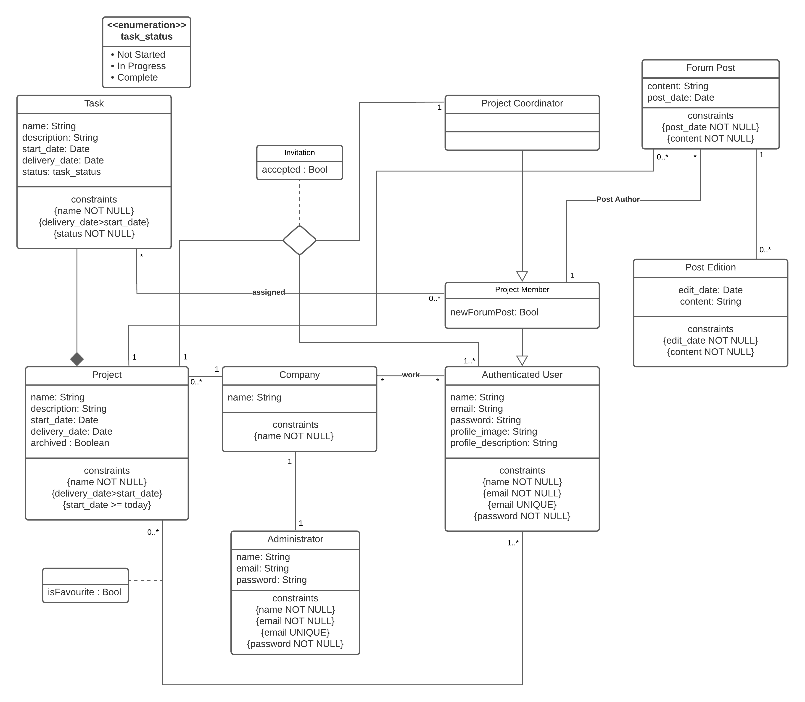

# EBD: Database Specification Component

Delivery Date: 29/11/2021 <br>
Editor: Henrique Pinho (up201805000) - up201805000@up.pt

This project aims to build an information system with a web interface for project management that allows teams of users to organize their professional projects. This application’s target audience are companies and teams working on complex projects, offering them a platform to organize every aspect of their workflow.

## A4: Conceptual Data Model


The Conceptual Domain Model contains the identification and description of the entities of the domain and the relationships between them in a UML class diagram.

A UML class diagram is used to document the model.

The class diagram is developed by starting to include only the classes and its relationships in order not to overload the diagram too early in the process. In the following iterations additional detail is included, namely: class attributes, attribute domains, multiplicity of associations, and additional restrictions in OCL.

### 1. Class diagram

The following diagram represents the main organizational entities, the relationships between them, attributes, and the multiplicity of relationships for our website.



### 2. Additional Business Rules

- Only the post's author can generate new Post Editions
- A user can't have more than 5 favorite projects
- When a user's account is deleted, every detail is kept, since it is considered work product

## A5: Relational Schema, validation and schema refinement

### 1. Relational Schema

Relation schemas are specified in the compact notation:

| Relation reference | Relation Compact Notation                                                                                                                                     |
| ------------------ | ------------------------------------------------------------------------------------------------------------------------------------------------------------- |
| R01                | user(id **PK**,email **UK NN**,name **NN**,password **NN**, profile_image, profile_description)                                                               |
| R02                | company(id **PK**,name **NN**)                                                                                                                                |
| R03                | administrator(id **PK**, email **PK**,name **NN**,company_id **NN**)                                                                                          |
| R04                | work(user_id **PK**,**company id**)                                                                                                                           |
| R05                | project(id **PK**, company_id **FK**,name **NN**, description, start_date **NN**, delivery_date **NN** **CK** delivery_date>start_date, archived)             |
| R06                | project_coordinator(user_id **PK**,project_id**PK**)                                                                                                          |
| R07                | project_member(user_id **PK**,company_id**PK**,seenNewForumPost **NN**)                                                                                       |
| R08                | task(id **PK**, project_id, name **NN**, description, start_date **NN**, delivery_date NN CK -> delivery > start, status **NN** **CK** status IN task_status) |
| R09                | task_assigned(project_coordinator_id **PK**, project_member_id **PK**,task_id **PK**,notified)                                                                |
| R10                | forum_post(id **PK**,project_id,project_member_id **NN**, content **NN**, post_date **NN**, deleted **NN**)                                                   |
| R11                | invitation(project_id **PK** ,user_id **PK**,coordinator_id **PK**, accepted **NN**)                                                                          |
| R12                | favorite(**project_id**, **user_id**)                                                                                                                         |
| R13                | post_edition(**id**,forum_post_id,edit_date **NN**, content **NN**)                                                                                           |

**Legend:**

**PK** = PRIMATY KEY

**UK** = UNIQUE KEY

**FK** = FOREIGN KEY

**NN** = NOT NULL

**CK** = CHECK.

### 2. Domains

Specification of additional domains:

| Domain Name | Domain Specification                           |
| ----------- | ---------------------------------------------- |
| task_status | ENUM('Not Started', 'In Progress', 'Complete') |

### 3. Schema validation

To validate the Relational Schema obtained from the Conceptual Data Model, all functional dependencies are identified and the normalization of all relation schemas is accomplished.

| **TABLE R01**               | user                                                             |
| --------------------------- | ---------------------------------------------------------------- |
| **Keys**                    | { id }, { email }                                                |
| **Functional Dependencies** |                                                                  |
| FD0101                      | id → {email, name, password, profile_image, profile_description} |
| FD0102                      | email → {id, name, password, profile_image, profile_description} |
| **NORMAL FORM**             | BCNF                                                             |

| **TABLE R02**               | company     |
| --------------------------- | ----------- |
| **Keys**                    | { id }      |
| **Functional Dependencies** |             |
| FD0101                      | id → {name} |
| **NORMAL FORM**             | BCNF        |

| **TABLE R03**               | administrator                  |
| --------------------------- | ------------------------------ |
| **Keys**                    | {id}, { email }                |
| **Functional Dependencies** |                                |
| FD0101                      | id → {name,email, company_id}  |
| FD0102                      | email → {id, name, company_id} |
| **NORMAL FORM**             | BCNF                           |

| **TABLE R04**               | work                    |
| --------------------------- | ----------------------- |
| **Keys**                    | { user_id, company_id } |
| **Functional Dependencies** |                         |
| FD0101                      | _none_                  |
| **NORMAL FORM**             | BCNF                    |

| **TABLE R05**               | project                                                                   |
| --------------------------- | ------------------------------------------------------------------------- |
| **Keys**                    | {id }                                                                     |
| **Functional Dependencies** |                                                                           |
| FD0101                      | id → {company_id, name, description, start_date, delivery_date, archived} |
| **NORMAL FORM**             | BCNF                                                                      |

| **TABLE R06**               | project_coordinator     |
| --------------------------- | ----------------------- |
| **Keys**                    | { user_id, project_id } |
| **Functional Dependencies** |                         |
| FD0101                      | _none_                  |
| **NORMAL FORM**             | BCNF                    |

| **TABLE R07**               | project_member                                |
| --------------------------- | --------------------------------------------- |
| **Keys**                    | { user_id, project_id }                       |
| **Functional Dependencies** |                                               |
| FD0101                      | { user_id, project_id } -> {seenNewForumPost} |
| **NORMAL FORM**             | BCNF                                          |

| **TABLE R08**               | task                                                                   |
| --------------------------- | ---------------------------------------------------------------------- |
| **Keys**                    | {id}                                                                   |
| **Functional Dependencies** |                                                                        |
| FD0101                      | id->{project_id, name, description, start_date, delivery_date, status} |
| **NORMAL FORM**             | BCNF                                                                   |

| **TABLE R09**               | task_assigned                                                    |
| --------------------------- | ---------------------------------------------------------------- |
| **Keys**                    | {project_coordinator_id, project_member_id, task_id}             |
| **Functional Dependencies** |                                                                  |
| FD0101                      | {project_coordinator_id, project_member_id, task_id}->{notified} |
| **NORMAL FORM**             | BCNF                                                             |

| **TABLE R10**               | forum_post                                                       |
| --------------------------- | ---------------------------------------------------------------- |
| **Keys**                    | {id}                                                             |
| **Functional Dependencies** |                                                                  |
| FD0101                      | id->{project_id, project_member_id, content, post_date, deleted} |
| **NORMAL FORM**             | BCNF                                                             |

| **TABLE R11**               | invitation                                         |
| --------------------------- | -------------------------------------------------- |
| **Keys**                    | {project_id, user_id, coordinator_id}              |
| **Functional Dependencies** |                                                    |
| FD0101                      | {project_id, user_id, coordinator_id} ->{accepted} |
| **NORMAL FORM**             | BCNF                                               |

| **TABLE R12**               | favorite             |
| --------------------------- | -------------------- |
| **Keys**                    | {user_id,project_id} |
| **Functional Dependencies** |                      |
| FD0101                      | _none_               |
| **NORMAL FORM**             | BCNF                 |

| **TABLE R13**               | post_edition                            |
| --------------------------- | --------------------------------------- |
| **Keys**                    | {id}                                    |
| **Functional Dependencies** |                                         |
| FD0101                      | id->{forum_post_id, edit_date, content} |
| **NORMAL FORM**             | BCNF                                    |

Because all relations are in the Boyce–Codd Normal Form (BCNF), the relational schema is also in the BCNF and, therefore, the schema does not need to be further normalized.

## A6: Indexes, triggers, transactions and database population

This artefact contains the database's workload, the physical schema of the database, its indexes, its triggers, the definition of some functions and transactions needed to assure the integrity of the data.
Besides all this, it also includes a link to the complete database creation script, including indexes and triggers.

### 1. Database Workload

It's essential to grasp the nature of the workload for the application and the performance objectives to develop a good database design. The workload includes an estimate of the number of tuples for each relation and also the estimated growth.

| **Relation reference** | **Relation Name**   | **Order of magnitude**       | **Estimated growth**   |
| ---------------------- | ------------------- | ---------------------------- | ---------------------- |
| R01                    | user                | 10k (tens of thousands)      | 10 (tens) / day        |
| R02                    | company             | 100 (hundreds)               | 1 (units) / day        |
| R03                    | administrator       | 100                          | 1 / day                |
| R04                    | work                | 10k                          | 10 / day               |
| R05                    | project             | 1k (thousands)               | 1 / day                |
| R06                    | project_coordinator | 1k                           | 1 / day                |
| R07                    | project_member      | 10k                          | 10 / day               |
| R08                    | task                | 100k (hundreds of thousands) | 100 (hundreds) / day   |
| R09                    | task_assigned       | 100k                         | 100 / day              |
| R10                    | forum_post          | 1kk (millions)               | 1000 (thousands) / day |
| R11                    | invitation          | 10k                          | 10 / day               |
| R12                    | favorite            | 1k                           | 1 / day                |
| R13                    | post_edition        | 100k                         | 100 (hundreds)/ day    |

### 2. Proposed Indexes

An index is used for looking something up in a table or any identical structure. This, however. takes extra memory since they are stored in memory and extra time when changing the table as the index needs to be updated as well

#### 2.1. Performance Indexes

| **Index**         | IDX01                                                                                                                                                                                                                                                                                                                                                                                                                                                                                                                                                                                                                                                                                                             |
| ----------------- | ----------------------------------------------------------------------------------------------------------------------------------------------------------------------------------------------------------------------------------------------------------------------------------------------------------------------------------------------------------------------------------------------------------------------------------------------------------------------------------------------------------------------------------------------------------------------------------------------------------------------------------------------------------------------------------------------------------------- |
| **Relation**      | project_member                                                                                                                                                                                                                                                                                                                                                                                                                                                                                                                                                                                                                                                                                                    |
| **Attribute**     | user_id                                                                                                                                                                                                                                                                                                                                                                                                                                                                                                                                                                                                                                                                                                           |
| **Type**          | B-tree                                                                                                                                                                                                                                                                                                                                                                                                                                                                                                                                                                                                                                                                                                            |
| **Cardinality**   | Medium                                                                                                                                                                                                                                                                                                                                                                                                                                                                                                                                                                                                                                                                                                            |
| **Clustering**    | Yes                                                                                                                                                                                                                                                                                                                                                                                                                                                                                                                                                                                                                                                                                                               |
| **Justification** | Table 'project_member' is large. Not large enough to justify an index just by its sheer size, but a very common query needs to filter every project by a certain member, so those two conditions justify an index. Since its cardinality is medium (due to multiple tuples having the same user_id -> high cardinality means to having mostly unique elements and low cardinality means having many repetead values) and update frequency isn't high, it's a good candidate for clustering. Clustering can't be used on hash type indexes, so a B-tree type index was opted for. The B-tree is the default index type and is used for exact matches or elements that have a greater or less than a certain value. |

```sql
CREATE INDEX project_member_user_index ON project_member USING btree (users_id); CLUSTER project_member USING project_member_user_index;
```

| **Index**         | IDX02                                                                                                                                                                                                                                                                                                                                                                                                                                                                                                                                                    |
| ----------------- | -------------------------------------------------------------------------------------------------------------------------------------------------------------------------------------------------------------------------------------------------------------------------------------------------------------------------------------------------------------------------------------------------------------------------------------------------------------------------------------------------------------------------------------------------------- |
| **Relation**      | project_member                                                                                                                                                                                                                                                                                                                                                                                                                                                                                                                                           |
| **Attribute**     | project_id                                                                                                                                                                                                                                                                                                                                                                                                                                                                                                                                               |
| **Type**          | Hash                                                                                                                                                                                                                                                                                                                                                                                                                                                                                                                                                     |
| **Cardinality**   | Medium                                                                                                                                                                                                                                                                                                                                                                                                                                                                                                                                                   |
| **Clustering**    | No                                                                                                                                                                                                                                                                                                                                                                                                                                                                                                                                                       |
| **Justification** | Table 'project_member' is large. Not large enough to justify an index just by its sheer size, but a very common query needs to filter every member of a certain project, so those two conditions justify an index. Despite its medium cardinality (due to multiple tuples having the same project_id) and medium update frequency, it's not a good candidate for clustering because the table is already clustered around user_id. For this, is will be used a hash index type where filtering is done by exact match, thus an hash type is best suited. |

```sql
CREATE INDEX project_member_project_index ON project_member USING hash(project_id);
```

| **Index**         | IDX03                                                                                                                                                                                                                                                                                                                                                                                                                                               |
| ----------------- | --------------------------------------------------------------------------------------------------------------------------------------------------------------------------------------------------------------------------------------------------------------------------------------------------------------------------------------------------------------------------------------------------------------------------------------------------- |
| **Relation**      | task_assigned                                                                                                                                                                                                                                                                                                                                                                                                                                       |
| **Attribute**     | project_member_id                                                                                                                                                                                                                                                                                                                                                                                                                                   |
| **Type**          | B-tree                                                                                                                                                                                                                                                                                                                                                                                                                                              |
| **Cardinality**   | Medium                                                                                                                                                                                                                                                                                                                                                                                                                                              |
| **Clustering**    | No                                                                                                                                                                                                                                                                                                                                                                                                                                                  |
| **Justification** | Table 'task_assigned' is very large and a very common query needs to filter every project assigned to a project member, so an index is necessary. Despite its medium cardinality (due to multiple tuples having the same project_member_id) and medium update frequency, it's not a good candidate for clustering. Clustering uses a lot of resources so it can take a lot of time, specially in this case where the tuple in question is so large. |

```sql
CREATE INDEX task_assigned_member_index ON task_assigned USING btree (project_member_id);
```

#### 2.2. Full-text Search Indixes

Full-Text Search Indexes are used when looking for full text. For each column wished to index for Full-Text Search you need to create a new column with auxiliary values for SQL algorithms to use.

| **Index**         | IDX04                                                                                                                                                                                                                      |
| ----------------- | -------------------------------------------------------------------------------------------------------------------------------------------------------------------------------------------------------------------------- |
| **Relation**      | forum_post                                                                                                                                                                                                                 |
| **Attribute**     | content                                                                                                                                                                                                                    |
| **Type**          | GIN                                                                                                                                                                                                                        |
| **Clustering**    | No                                                                                                                                                                                                                         |
| **Justification** | Used for improving the performance of full text search while searching for a specific term in of the biggest table of the database, 'task'. GIN was used because a task's name and description are not updated frequently. |

```sql
ALTER TABLE task
ADD COLUMN tsvectors TSVECTOR;

CREATE FUNCTION task_search_update() RETURNS TRIGGER AS $$
BEGIN
IF TG_OP = 'INSERT' THEN
       NEW.tsvectors = (
        setweight(to_tsvector('english', NEW.name), 'A') ||
        setweight(to_tsvector('english', NEW.description), 'B')
       );
END IF;
IF TG_OP = 'UPDATE' THEN
        IF (NEW.name <> OLD.name OR NEW.description <> OLD.description) THEN
          NEW.tsvectors = (
            setweight(to_tsvector('english', NEW.name), 'A') ||
            setweight(to_tsvector('english', NEW.description), 'B')
          );
        END IF;
END IF;
RETURN NEW;
END $$
LANGUAGE plpgsql;

CREATE TRIGGER task_search_update
BEFORE INSERT OR UPDATE ON task
FOR EACH ROW
EXECUTE PROCEDURE task_search_update();
```

### 3. Triggers

User-defined functions and trigger procedures that add control structures to the SQL language or perform complex computations, are identified and described to be trusted by the database server. Every kind of function (SQL functions, Stored procedures, Trigger procedures) can take base types, composite types, or combinations of these as arguments (parameters). In addition, every kind of function can return a base type or a composite type. Functions can also be defined to return sets of base or composite values.

| **Trigger**     | TRIGGER01                                        |
| --------------- | ------------------------------------------------ |
| **Description** | A user cannot have more than 5 favorite projects |

```sql
CREATE FUNCTION add_favorite() RETURNS TRIGGER AS
$BODY$
BEGIN
IF ((SELECT COUNT(*) FROM favorite WHERE NEW.users_id = users_id)=5) THEN
RAISE EXCEPTION 'A user cant have more than 5 favorite projects';
END IF;
RETURN NEW;
END
$BODY$
LANGUAGE plpgsql;

CREATE TRIGGER add_favorite
BEFORE INSERT OR UPDATE ON favorite
FOR EACH ROW
EXECUTE PROCEDURE add_favorite();
```

| **Trigger**     | TRIGGER02                                                                   |
| --------------- | --------------------------------------------------------------------------- |
| **Description** | When a project is archived, it is removed from the users' favorite projects |

```sql
CREATE FUNCTION remove_favorites() RETURNS TRIGGER AS
$BODY$
BEGIN
IF (NEW.archived=TRUE) THEN
DELETE FROM favorite WHERE NEW.id = project_id;
END IF;
RETURN NEW;
END
$BODY$
LANGUAGE plpgsql;

CREATE TRIGGER remove_favorites
BEFORE UPDATE ON project
FOR EACH ROW
EXECUTE PROCEDURE remove_favorites();
```

| **Trigger**     | TRIGGER03                                                             |
| --------------- | --------------------------------------------------------------------- |
| **Description** | Changing the content of a forum post creates a new Post Edition entry |

```sql
CREATE FUNCTION add_edit() RETURNS TRIGGER AS
$BODY$
BEGIN
IF (NEW.content!=OLD.content) THEN
INSERT INTO post_edition VALUES(DEFAULT,OLD.id,DEFAULT,OLD.content);
END IF;
RETURN NEW;
END
$BODY$
LANGUAGE plpgsql;

CREATE TRIGGER add_edit
BEFORE UPDATE ON forum_post
FOR EACH ROW
EXECUTE PROCEDURE add_edit();
```

### 4. Transactions

> Transactions needed to assure the integrity of the data.

| TRAN01          | Assign new Task                                                                                                                                                                                                                                                                                                                                             |
| --------------- | ----------------------------------------------------------------------------------------------------------------------------------------------------------------------------------------------------------------------------------------------------------------------------------------------------------------------------------------------------------- |
| Justification   | The isolation level is Repeatable Read, because, with it , transactions can only read committed records and between two reads the transactions cannot modify the record . Otherwise, an update of project:id could happen, due to an insert in the table project committed by a concurrent transaction, and as a result, inconsistent data would be stored. |
| Isolation level | REPEATABLE READ                                                                                                                                                                                                                                                                                                                                             |

```sql
BEGIN TRANSACTION;

SET TRANSACTION ISOLATION LEVEL REPEATABLE READ;

-- Insert task
INSERT INTO task(project_id, name, description, start_date, delivery_date, status)
 VALUES ($project_id, $name, $description, $start_date, $delivery_date, $status);

-- Insert task assigned
INSERT INTO task_assigned(project_coordinator_id, project_member_id, task_id, notified)
 VALUES ($project_coordinator_id, $project_member_id, currval('task_id_seq'), $notified);

END TRANSACTION;
```

| TRAN02          | Get current Project Members                                                                                                                                                                                                                                                                                                                                                                                                                                            |
| --------------- | ---------------------------------------------------------------------------------------------------------------------------------------------------------------------------------------------------------------------------------------------------------------------------------------------------------------------------------------------------------------------------------------------------------------------------------------------------------------------- |
| Justification   | In the middle of the transaction, the insertion of new rows in the project_member table can occur, which implies that the information retrieved in both selects is different, consequently resulting in a Phantom Read (a transaction re-executes a query and finds that the results have changed by another transaction). Aiming for a less restrictive isolation level that still guarantees its data is consistent, we used READ ONLY (since it only uses Selects). |
| Isolation level | SERIALIZABLE READ ONLY                                                                                                                                                                                                                                                                                                                                                                                                                                                 |

```sql
BEGIN TRANSACTION;

SET TRANSACTION ISOLATION LEVEL SERIALIZABLE READ ONLY;

-- Get project members
SELECT name, email, project.id
FROM user
INNER JOIN project_member ON id = project_member.users_id
INNER JOIN company ON project_member.company_id = company.id
INNER JOIN project ON company.id = project.company_id
ORDER BY project.id ASC;

END TRANSACTION;
```

## Annex A. SQL Code

> The database scripts are included in this annex to the EBD component.
>
> The database creation script and the population script should be presented as separate elements.
> The creation script includes the code necessary to build (and rebuild) the database.
> The population script includes an amount of tuples suitable for testing and with plausible values for the fields of the database.
>
> This code should also be included in the group's git repository and links added here.

### A.1. Database schema

```sql
DROP TABLE IF EXISTS users CASCADE;
DROP TABLE IF EXISTS company CASCADE;
DROP TABLE IF EXISTS administrator CASCADE;
DROP TABLE IF EXISTS work CASCADE;
DROP TABLE IF EXISTS project CASCADE;
DROP TABLE IF EXISTS project_coordinator CASCADE;
DROP TABLE IF EXISTS project_member CASCADE;
DROP TABLE IF EXISTS task CASCADE;
DROP TABLE IF EXISTS task_assigned CASCADE;
DROP TABLE IF EXISTS forum_post CASCADE;
DROP TABLE IF EXISTS invitation CASCADE;
DROP TABLE IF EXISTS favorite CASCADE;
DROP TABLE IF EXISTS post_edition CASCADE;

DROP TYPE IF EXISTS task_status;

DROP FUNCTION IF EXISTS add_favorite;
DROP FUNCTION IF EXISTS remove_favorites;
DROP FUNCTION IF EXISTS add_edit;
DROP FUNCTION IF EXISTS task_search_update;

CREATE TYPE task_status AS ENUM('Not Started','In Progress', 'Complete');

CREATE TABLE users (
    id SERIAL PRIMARY KEY,
    email TEXT NOT NULL UNIQUE,
    name TEXT NOT NULL,
    password TEXT NOT NULL,
    profile_image TEXT NOT NULL,
    profile_description TEXT
);

CREATE TABLE company(
    id SERIAL PRIMARY KEY,
    name TEXT NOT NULL
);

CREATE TABLE administrator(
    id SERIAL PRIMARY KEY,
    email TEXT NOT NULL,
    name TEXT NOT NULL,
    company_id INTEGER NOT NULL REFERENCES company(id)
);

CREATE TABLE work(
    users_id INTEGER NOT NULL REFERENCES users(id) ON DELETE CASCADE,
    company_id INTEGER NOT NULL REFERENCES company(id) ON DELETE CASCADE,
    PRIMARY KEY(users_id,company_id)
);

CREATE TABLE project (
    id SERIAL PRIMARY KEY,
    company_id INTEGER NOT NULL REFERENCES company(id) ON DELETE CASCADE,
    name TEXT NOT NULL,
    description TEXT,
    start_date TIMESTAMP WITH TIME ZONE,
    delivery_date TIMESTAMP WITH TIME ZONE,
    archived BOOLEAN DEFAULT FALSE NOT NULL,
    CONSTRAINT date_ck CHECK (delivery_date>start_date)
);

CREATE TABLE project_coordinator(
    users_id INTEGER NOT NULL REFERENCES users(id) ON DELETE CASCADE,
    project_id INTEGER NOT NULL REFERENCES project(id) ON DELETE CASCADE,
    PRIMARY KEY(users_id,project_id)
);

CREATE TABLE project_member(
    users_id INTEGER NOT NULL REFERENCES users(id) ON DELETE CASCADE,
    project_id INTEGER NOT NULL REFERENCES project(id) ON DELETE CASCADE,
    seenNewForumPost BOOLEAN DEFAULT TRUE NOT NULL,
    PRIMARY KEY(users_id,project_id)
);

CREATE TABLE task (
    id SERIAL PRIMARY KEY,
    project_id INTEGER NOT NULL REFERENCES project(id) ON DELETE CASCADE,
    name TEXT NOT NULL,
    description TEXT,
    start_date TIMESTAMP WITH TIME ZONE,
    delivery_date TIMESTAMP WITH TIME ZONE,
    status task_status DEFAULT 'Not Started',
    CONSTRAINT date_ck CHECK (delivery_date>start_date)
);

CREATE TABLE task_assigned(
    project_coordinator_id INTEGER NOT NULL REFERENCES users(id),
    project_member_id INTEGER NOT NULL REFERENCES users(id),
    task_id INTEGER NOT NULL REFERENCES task(id),
    notified BOOLEAN DEFAULT FALSE NOT NULL,
    PRIMARY KEY(project_coordinator_id,project_member_id,task_id)
);

CREATE TABLE forum_post(
    id SERIAL PRIMARY KEY,
    project_id INTEGER NOT NULL REFERENCES project(id),
    project_member_id INTEGER NOT NULL REFERENCES users(id),
    content TEXT,
    post_date TIMESTAMP WITH TIME ZONE DEFAULT now() NOT NULL,
    deleted BOOLEAN DEFAULT FALSE NOT NULL
);

CREATE TABLE invitation(
    project_id INTEGER NOT NULL REFERENCES project(id),
    users_id INTEGER NOT NULL REFERENCES users(id),
    coordinator_id INTEGER NOT NULL REFERENCES users(id),
    accepted BOOLEAN,
    PRIMARY KEY(project_id,users_id,coordinator_id)
);

CREATE TABLE favorite(
    project_id INTEGER NOT NULL REFERENCES project(id),
    users_id INTEGER NOT NULL REFERENCES users(id),
    PRIMARY KEY(project_id,users_id)
);

CREATE TABLE post_edition(
    id SERIAL PRIMARY KEY,
    post_id INTEGER NOT NULL REFERENCES forum_post(id),
    edit_date TIMESTAMP WITH TIME ZONE DEFAULT now() NOT NULL,
    content TEXT
);

-- INDEX 1

CREATE INDEX project_member_user_index  ON project_member USING btree (users_id); CLUSTER project_member USING project_member_user_index;

-- INDEX 2

CREATE INDEX project_member_project_index  ON project_member  USING hash(project_id);

-- INDEX 3

CREATE INDEX task_assigned_member_index  ON task_assigned USING btree  (project_member_id);

-- INDEX 4

ALTER TABLE task
ADD COLUMN tsvectors TSVECTOR;

CREATE FUNCTION task_search_update() RETURNS TRIGGER AS $$
BEGIN
 IF TG_OP = 'INSERT' THEN
        NEW.tsvectors = (
         setweight(to_tsvector('english', NEW.name), 'A') ||
         setweight(to_tsvector('english', NEW.description), 'B')
        );
 END IF;
 IF TG_OP = 'UPDATE' THEN
         IF (NEW.name <> OLD.name OR NEW.description <> OLD.description) THEN
           NEW.tsvectors = (
             setweight(to_tsvector('english', NEW.name), 'A') ||
             setweight(to_tsvector('english', NEW.description), 'B')
           );
         END IF;
 END IF;
 RETURN NEW;
END $$
LANGUAGE plpgsql;

CREATE TRIGGER task_search_update
BEFORE INSERT OR UPDATE ON task
FOR EACH ROW
EXECUTE PROCEDURE task_search_update();

-- TRIGGER 1

CREATE FUNCTION add_favorite() RETURNS TRIGGER AS
$BODY$
	BEGIN
		IF ((SELECT COUNT(*) FROM favorite WHERE NEW.users_id = users_id)=5) THEN
		RAISE EXCEPTION 'A user cant have more than 5 favorite projects';
		END IF;
		RETURN NEW;
	END
$BODY$
LANGUAGE plpgsql;

CREATE TRIGGER add_favorite
BEFORE INSERT OR UPDATE ON favorite
FOR EACH ROW
EXECUTE PROCEDURE add_favorite();

-- TRIGGER 2

CREATE FUNCTION remove_favorites() RETURNS TRIGGER AS
$BODY$
BEGIN
IF (NEW.archived=TRUE) THEN
DELETE FROM favorite WHERE NEW.id = project_id;
END IF;
RETURN NEW;
END
$BODY$
LANGUAGE plpgsql;

CREATE TRIGGER remove_favorites
BEFORE UPDATE ON project
FOR EACH ROW
EXECUTE PROCEDURE remove_favorites();

-- TRIGGER 3

CREATE FUNCTION add_edit() RETURNS TRIGGER AS
$BODY$
BEGIN
IF (NEW.content!=OLD.content) THEN
INSERT INTO post_edition VALUES(DEFAULT,OLD.id,DEFAULT,OLD.content);
END IF;
RETURN NEW;
END
$BODY$
LANGUAGE plpgsql;

CREATE TRIGGER add_edit
BEFORE UPDATE ON forum_post
FOR EACH ROW
EXECUTE PROCEDURE add_edit();
```

### A.2. Database population

```sql
INSERT INTO users (id, email, name, password, profile_image, profile_description) VALUES
(DEFAULT, 'alberto.noronha@gmail.com', 'Alberto Noronha', 'pass1221ssap', 'pictures/defaultPicture.png', 'I am a happy user of this beautiful platform!' ),
(DEFAULT, 'patricia123silva@gmail.com', 'Patrícia Silva', 'pass1221ssap', 'pictures/defaultPicture.png', 'I am a happy user of this beautiful platform!' ),
(DEFAULT, 'marco.a.serra@gmail.com', 'Marco Serra', 'pass1221ssap', 'pictures/defaultPicture.png', 'I am a happy user of this beautiful platform!' ),
(DEFAULT, 'maggygoncalves2000@gmail.com', 'Margarida Gonçalves', 'pass1221ssap', 'pictures/defaultPicture.png', 'I am a happy user of this beautiful platform!' ),
(DEFAULT, 'bandreia.lopess@gmail.com', 'Beatriz Andreia Lopes', 'pass1221ssap', 'pictures/defaultPicture.png', 'I am a happy user of this beautiful platform!' ),
(DEFAULT, 'ana.leonor_valente99@gmail.com', 'Ana Leonor Valente', 'pass1221ssap', 'pictures/defaultPicture.png', 'I am a happy user of this beautiful platform!' ),
(DEFAULT, 'dani4490barroso@gmail.com', 'Daniel Barroso', 'pass1221ssap', 'pictures/defaultPicture.png', 'I am a happy user of this beautiful platform!' ),
(DEFAULT, 'ana_julia_ferreira@gmail.com', 'Juliana Ferreira', 'pass1221ssap', 'pictures/defaultPicture.png', 'I am a happy user of this beautiful platform!' ),
(DEFAULT, 'xavierrodrigues@gmail.com', 'Xavier Rodrigues', 'pass1221ssap', 'pictures/defaultPicture.png', 'I am a happy user of this beautiful platform!' ),
(DEFAULT, 'vvasconcellos@gmail.com', 'Vicente Vasconcellos', 'pass1221ssap', 'pictures/defaultPicture.png', 'I am a happy user of this beautiful platform!' ),
(DEFAULT, 'concha_cortereal@gmail.com', 'Concha Corte-Real', 'pass1221ssap', 'pictures/defaultPicture.png', 'I am a happy user of this beautiful platform!' ),
(DEFAULT, 'ze.carlos.faria2001@gmail.com', 'José Carlos Faria', 'pass1221ssap', 'pictures/defaultPicture.png', 'I am a happy user of this beautiful platform!' ),
(DEFAULT, 'joanareis662@gmail.com', 'Joana Reis', 'pass1221ssap', 'pictures/defaultPicture.png', 'I am a happy user of this beautiful platform!' ),
(DEFAULT, 'marta.t.ramos@gmail.com', 'Marta Ramos', 'pass1221ssap', 'pictures/defaultPicture.png', 'I am a happy user of this beautiful platform!' ),
(DEFAULT, 'ruigomes1999@gmail.com', 'Rui Gomes', 'pass1221ssap', 'pictures/defaultPicture.png', 'I am a happy user of this beautiful platform!' ),
(DEFAULT, 'teresa.gomeslima2@gmail.com', 'Teresa Lima', 'pass1221ssap', 'pictures/defaultPicture.png', 'I am a happy user of this beautiful platform!' ),
(DEFAULT, 'moreiraraquel1@gmail.com', 'Raquel Moreira', 'pass1221ssap', 'pictures/defaultPicture.png', 'I am a happy user of this beautiful platform!' ),
(DEFAULT, 'mikecasanova4480@gmail.com', 'Miguel Casanova', 'pass1221ssap', 'pictures/defaultPicture.png', 'I am a happy user of this beautiful platform!' ),
(DEFAULT, 'ines_f_silva@gmail.com', 'Inês José Silva', 'pass1221ssap', 'pictures/defaultPicture.png', 'I am a happy user of this beautiful platform!' ),
(DEFAULT, 'tonimiranda02@gmail.com', 'António Miranda', 'pass1221ssap', 'pictures/defaultPicture.png', 'I am a happy user of this beautiful platform!' ),
(DEFAULT, 'manelgustavodesousa@gmail.com', 'Manuel Sousa', 'pass1221ssap', 'pictures/defaultPicture.png', 'I am a happy user of this beautiful platform!' ),
(DEFAULT, 'jtavares90210@gmail.com', 'João Tavares', 'pass1221ssap', 'pictures/defaultPicture.png', 'I am a happy user of this beautiful platform!' ),
(DEFAULT, 'marcelonacl@gmail.com', 'Marcelo Salgado', 'pass1221ssap', 'pictures/defaultPicture.png', 'I am a happy user of this beautiful platform!' ),
(DEFAULT, 'mmariana_arruda123@gmail.com', 'Mariana Arruda', 'pass1221ssap', 'pictures/defaultPicture.png', 'I am a happy user of this beautiful platform!' ),
(DEFAULT, 'paulowind1230@gmail.com', 'Paulo Ventos', 'pass1221ssap', 'pictures/defaultPicture.png', 'I am a happy user of this beautiful platform!' ),
(DEFAULT, 'lara.grios99@gmail.com', 'Lara Rios', 'pass1221ssap', 'pictures/defaultPicture.png', 'I am a happy user of this beautiful platform!' ),
(DEFAULT, 'goncalogoncalves98@gmail.com', 'Gonçalo Gonçalves', 'pass1221ssap', 'pictures/defaultPicture.png', 'I am a happy user of this beautiful platform!' ),
(DEFAULT, 'nunotmartins9@gmail.com', 'Nuno Martins', 'pass1221ssap', 'pictures/defaultPicture.png', 'I am a happy user of this beautiful platform!' ),
(DEFAULT, 'mikegsantos07@gmail.com', 'Miguel Santos', 'pass1221ssap', 'pictures/defaultPicture.png', 'I am a happy user of this beautiful platform!' ),
(DEFAULT, 'carina_m_faria@gmail.com', 'Carina Faria', 'pass1221ssap', 'pictures/defaultPicture.png', 'I am a happy user of this beautiful platform!' ),
(DEFAULT, 'malexandra_antas@gmail.com', 'Maria Antas',  'pass1221ssap', 'pictures/defaultPicture.png', 'I am a happy user of this beautiful platform!' ),
(DEFAULT, 'ericajantunes01@gmail.com', 'Érica Antunes', 'pass1221ssap', 'pictures/defaultPicture.png', 'I am a happy user of this beautiful platform!' ),
(DEFAULT, 'vitoriaalbuquerque@gmail.com', 'Vitória Albuquerque', 'pass1221ssap', 'pictures/defaultPicture.png', 'I am a happy user of this beautiful platform!' ),
(DEFAULT, 'basilva08@gmail.com', 'Bárbara Silva', 'pass1221ssap', 'pictures/defaultPicture.png', 'I am a happy user of this beautiful platform!' ),
(DEFAULT, 'carlos.sgomes@gmail.com', 'Carlos Gomes', 'pass1221ssap', 'pictures/defaultPicture.png', 'I am a happy user of this beautiful platform!' ),
(DEFAULT, 'gustavo_lima76@gmail.com', 'Gustavo Lima', 'pass1221ssap', 'pictures/defaultPicture.png', 'I am a happy user of this beautiful platform!' ),
(DEFAULT, 'simone.rego@gmail.com', 'Simone Rego', 'pass1221ssap', 'pictures/defaultPicture.png', 'I am a happy user of this beautiful platform!' ),
(DEFAULT, 'sjose.lopes01@gmail.com', 'Sandro Lopes', 'pass1221ssap', 'pictures/defaultPicture.png', 'I am a happy user of this beautiful platform!' ),
(DEFAULT, 'alexanderbwalter@gmail.com', 'Alexandre Walter', 'pass1221ssap', 'pictures/defaultPicture.png', 'I am a happy user of this beautiful platform!' ),
(DEFAULT, 'filipe.lbabo@gmail.com', 'Filipe Babo', 'pass1221ssap', 'pictures/defaultPicture.png', 'I am a happy user of this beautiful platform!' ),
(DEFAULT, 'tatianapires0213@gmail.com', 'Tatiana Pires', 'pass1221ssap', 'pictures/defaultPicture.png', 'I am a happy user of this beautiful platform!' ),
(DEFAULT, 'yolandacarinaferreira@gmail.com', 'Yolanda Ferreira', 'pass1221ssap', 'pictures/defaultPicture.png', 'I am a happy user of this beautiful platform!' ),
(DEFAULT, 'andreiajgoncalves01@gmail.com', 'Andreia Gonçalves', 'pass1221ssap', 'pictures/defaultPicture.png', 'I am a happy user of this beautiful platform!' ),
(DEFAULT, 'nunoalves4490@gmail.com', 'Nuno Alves', 'pass1221ssap', 'pictures/defaultPicture.png', 'I am a happy user of this beautiful platform!' ),
(DEFAULT, 'matildenikesantos@gmail.com', 'Matilde Santos', 'pass1221ssap', 'pictures/defaultPicture.png', 'I am a happy user of this beautiful platform!' ),
(DEFAULT, 'anagomestavares1@gmail.com', 'Ana Tavares', 'pass1221ssap', 'pictures/defaultPicture.png', 'I am a happy user of this beautiful platform!' ),
(DEFAULT, 'mantoniasantosr01@gmail.com', 'Maria Antónia Ramos', 'pass1221ssap', 'pictures/defaultPicture.png', 'I am a happy user of this beautiful platform!' ),
(DEFAULT, 'olga.ramos98@gmail.com', 'Olga Ramos', 'pass1221ssap', 'pictures/defaultPicture.png', 'I am a happy user of this beautiful platform!' ),
(DEFAULT, 'bruno_albuquerque420@gmail.com', 'Bruno Albuquerque', 'pass1221ssap', 'pictures/defaultPicture.png', 'I am a happy user of this beautiful platform!' ),
(DEFAULT, 'barbarahlopes03@gmail.com', 'Bárbara Lopes', 'pass1221ssap', 'pictures/defaultPicture.png', 'I am a happy user of this beautiful platform!' ),
(DEFAULT, 'carloscorceiro4@gmail.com', 'Carlos Corceiro', 'pass1221ssap', 'pictures/defaultPicture.png', 'I am a happy user of this beautiful platform!' ),
(DEFAULT, 'joanamlima76@gmail.com', 'Joana Lima', 'pass1221ssap', 'pictures/defaultPicture.png', 'I am a happy user of this beautiful platform!' ),
(DEFAULT, 'tiago_marques_01@gmail.com', 'Tiago Marques', 'pass1221ssap', 'pictures/defaultPicture.png', 'I am a happy user of this beautiful platform!' ),
(DEFAULT, 'sandramariaoliveira1@gmail.com', 'Sandra Oliveira', 'pass1221ssap', 'pictures/defaultPicture.png', 'I am a happy user of this beautiful platform!' ),
(DEFAULT, 'dfmp08@gmail.com', 'Daniela Pinho', 'pass1221ssap', 'pictures/defaultPicture.png', 'I am a happy user of this beautiful platform!' ),
(DEFAULT, 'carol.carneiro02@gmail.com', 'Carolina Carneiro', 'pass1221ssap', 'pictures/defaultPicture.png', 'I am a happy user of this beautiful platform!' ),
(DEFAULT, 'mgloriafigueira123@gmail.com', 'Glória Figueira', 'pass1221ssap', 'pictures/defaultPicture.png', 'I am a happy user of this beautiful platform!' ),
(DEFAULT, 'fatimaoliveiratrigo21@gmail.com', 'Fátima Trigo', 'pass1221ssap', 'pictures/defaultPicture.png', 'I am a happy user of this beautiful platform!' ),
(DEFAULT, 'limabruno03@gmail.com', 'Bruno Lima', 'pass1221ssap', 'pictures/defaultPicture.png', 'I am a happy user of this beautiful platform!' ),
(DEFAULT, 'fabiovieira007@gmail.com', 'Fábio Vieira', 'pass1221ssap', 'pictures/defaultPicture.png', 'I am a happy user of this beautiful platform!' ),
(DEFAULT, 'jalbertopires01@gmail.com', 'Alberto Pires', 'pass1221ssap', 'pictures/defaultPicture.png', 'I am a happy user of this beautiful platform!' ),
(DEFAULT, 'zemiguel_costa05@gmail.com', 'José Costa', 'pass1221ssap', 'pictures/defaultPicture.png', 'I am a happy user of this beautiful platform!' ),
(DEFAULT, 'hugoferreira_02@gmail.com', 'Hugo Ferreira', 'pass1221ssap', 'pictures/defaultPicture.png', 'I am a happy user of this beautiful platform!' ),
(DEFAULT, 'fernandomfcorreia1@gmail.com', 'Fernando Correia', 'pass1221ssap', 'pictures/defaultPicture.png', 'I am a happy user of this beautiful platform!' ),
(DEFAULT, 'carlitos123moreira@gmail.com', 'Carlos Moreira', 'pass1221ssap', 'pictures/defaultPicture.png', 'I am a happy user of this beautiful platform!' ),
(DEFAULT, 'edu_braga4400@gmail.com', 'Eduardo Braga', 'pass1221ssap', 'pictures/defaultPicture.png', 'I am a happy user of this beautiful platform!' ),
(DEFAULT, 'beatrizmsmatos01@gmail.com', 'Beatriz Matos', 'pass1221ssap', 'pictures/defaultPicture.png', 'I am a happy user of this beautiful platform!' ),
(DEFAULT, 'fernandofernandes90210@gmail.com', 'Fernando Fernandes', 'pass1221ssap', 'pictures/defaultPicture.png', 'I am a happy user of this beautiful platform!' ),
(DEFAULT, 'zerui_silva321@gmail.com', 'Rui Silva', 'pass1221ssap', 'pictures/defaultPicture.png', 'I am a happy user of this beautiful platform!' ),
(DEFAULT, 'sara.treibeiro8@gmail.com', 'Sara Ribeiro', 'pass1221ssap', 'pictures/defaultPicture.png', 'I am a happy user of this beautiful platform!' ),
(DEFAULT, 'mateus.matias10@gmail.com', 'Mateus Matias', 'pass1221ssap', 'pictures/defaultPicture.png', 'I am a happy user of this beautiful platform!' ),
(DEFAULT, 'matilde.matias10@gmail.com', 'Matilde Matias', 'pass1221ssap', 'pictures/defaultPicture.png', 'I am a happy user of this beautiful platform!' ),
(DEFAULT, 'antonio_alves45@gmail.com', 'António Alves', 'pass1221ssap', 'pictures/defaultPicture.png', 'I am a happy user of this beautiful platform!' ),
(DEFAULT, 'luanasalgado73@gmail.com', 'Luana Salgado', 'pass1221ssap', 'pictures/defaultPicture.png', 'I am a happy user of this beautiful platform!' ),
(DEFAULT, 'islatrancoso@gmail.com', 'Isla Trancoso', 'pass1221ssap', 'pictures/defaultPicture.png', 'I am a happy user of this beautiful platform!' ),
(DEFAULT, 'martagmiranda01@gmail.com', 'Marta Miranda', 'pass1221ssap', 'pictures/defaultPicture.png', 'I am a happy user of this beautiful platform!' ),
(DEFAULT, 'jrodrigues4490@gmail.com', 'João Rodrigues', 'pass1221ssap', 'pictures/defaultPicture.png', 'I am a happy user of this beautiful platform!' ),
(DEFAULT, 'mike_boavista@gmail.com', 'Miguel Boavista', 'pass1221ssap', 'pictures/defaultPicture.png', 'I am a happy user of this beautiful platform!' ),
(DEFAULT, 'bidebidebide1@gmail.com', 'David Silva', 'pass1221ssap', 'pictures/defaultPicture.png', 'I am a happy user of this beautiful platform!' ),
(DEFAULT, 'sofiatcunhaaa@gmail.com', 'Sofia Cunha', 'pass1221ssap', 'pictures/defaultPicture.png', 'I am a happy user of this beautiful platform!' ),
(DEFAULT, 'gustavomcabral02@gmail.com', 'Gustavo Cabral', 'pass1221ssap', 'pictures/defaultPicture.png', 'I am a happy user of this beautiful platform!' ),
(DEFAULT, 'hmgomes97@gmail.com', 'Hugo Gomes', 'pass1221ssap', 'pictures/defaultPicture.png', 'I am a happy user of this beautiful platform!' ),
(DEFAULT, 'hugofrodrigues@gmail.com', 'Hugo Rodrigues', 'pass1221ssap', 'pictures/defaultPicture.png', 'I am a happy user of this beautiful platform!' ),
(DEFAULT, 'simoneamartins@gmail.com', 'Simone Martins', 'pass1221ssap', 'pictures/defaultPicture.png', 'I am a happy user of this beautiful platform!' ),
(DEFAULT, 'tiago5andrade5@gmail.com', 'Tiago Andrade', 'pass1221ssap', 'pictures/defaultPicture.png', 'I am a happy user of this beautiful platform!' ),
(DEFAULT, 'taniamariaramos05@gmail.com', 'Tânia Ramos', 'pass1221ssap', 'pictures/defaultPicture.png', 'I am a happy user of this beautiful platform!' ),
(DEFAULT, 'niltonrodrigues10@gmail.com', 'Nilton Rodrigues', 'pass1221ssap', 'pictures/defaultPicture.png', 'I am a happy user of this beautiful platform!' ),
(DEFAULT, 'sonia.ribas05@gmail.com', 'Sónia Ribas', 'pass1221ssap', 'pictures/defaultPicture.png', 'I am a happy user of this beautiful platform!' ),
(DEFAULT, 'simao_rlopes99@gmail.com', 'Simão Lopes', 'pass1221ssap', 'pictures/defaultPicture.png', 'I am a happy user of this beautiful platform!' ),
(DEFAULT, 'mmarianamarques1@gmail.com', 'Mariana Marques', 'pass1221ssap', 'pictures/defaultPicture.png', 'I am a happy user of this beautiful platform!' ),
(DEFAULT, 'rogeriofaguntes@gmail.com', 'Rogério Faguntes', 'pass1221ssap', 'pictures/defaultPicture.png', 'I am a happy user of this beautiful platform!' ),
(DEFAULT, 'lucianatravessass@gmail.com', 'Luciana Travessas', 'pass1221ssap', 'pictures/defaultPicture.png', 'I am a happy user of this beautiful platform!' ),
(DEFAULT, 'miguelalone1@gmail.com', 'Miguel Sozinho', 'pass1221ssap', 'pictures/defaultPicture.png', 'I am a happy user of this beautiful platform!' ),
(DEFAULT, 'anaraquelmiranda01@gmail.com', 'Ana Raquel Miranda', 'pass1221ssap', 'pictures/defaultPicture.png', 'I am a happy user of this beautiful platform!' ),
(DEFAULT, 'marcelo.sousa.01@gmail.com', 'Marcelo Sousa', 'pass1221ssap', 'pictures/defaultPicture.png', 'I am a happy user of this beautiful platform!' ),
(DEFAULT, 'taniadcouto@gmail.com', 'Tânia Couto', 'pass1221ssap', 'pictures/defaultPicture.png', 'I am a happy user of this beautiful platform!' ),
(DEFAULT, 'vaniamorango1@gmail.com', 'Vânia Morango', 'pass1221ssap', 'pictures/defaultPicture.png', 'I am a happy user of this beautiful platform!' ),
(DEFAULT, 'tomas.janeiro1@gmail.com', 'Tomás Janeiro', 'pass1221ssap', 'pictures/defaultPicture.png', 'I am a happy user of this beautiful platform!' ),
(DEFAULT, 'filipa-morier@gmail.com', 'Filipa Moreira', 'pass1221ssap', 'pictures/defaultPicture.png', 'I am a happy user of this beautiful platform!' ),
(DEFAULT, 'zalonogueira@gmail.com', 'Gonçalo Nogueira', 'pass1221ssap', 'pictures/defaultPicture.png', 'I am a happy user of this beautiful platform!' ),
(DEFAULT, 'bbfernandes98@gmail.com', 'Beatriz Fernandes', 'pass1221ssap', 'pictures/defaultPicture.png', 'I am a happy user of this beautiful platform!' ),
(DEFAULT, 'macacolider86@gmail.com', 'Fernando Madureira', 'pass1221ssap', 'pictures/defaultPicture.png', 'I am a happy user of this beautiful platform!' ),
(DEFAULT, 'zetonesilva23@gmail.com', 'António Silva', 'pass1221ssap', 'pictures/defaultPicture.png', 'I am a happy user of this beautiful platform!' ),
(DEFAULT, 'nelsinhoagra@gmail.com', 'Nelson Agra', 'pass1221ssap', 'pictures/defaultPicture.png', 'I am a happy user of this beautiful platform!' ),
(DEFAULT, 'alexandreccosta1@gmail.com', 'Alexandre Costa', 'pass1221ssap', 'pictures/defaultPicture.png', 'I am a happy user of this beautiful platform!' ),
(DEFAULT, 'brunosilvagoncalves@gmail.com', 'Bruno Gonçalves', 'pass1221ssap', 'pictures/defaultPicture.png', 'I am a happy user of this beautiful platform!' ),
(DEFAULT, 'wilson1santos@gmail.com', 'Wilson Santos', 'pass1221ssap', 'pictures/defaultPicture.png', 'I am a happy user of this beautiful platform!' ),
(DEFAULT, 'carlateixeirat1@gmail.com', 'Carla Torres', 'pass1221ssap', 'pictures/defaultPicture.png', 'I am a happy user of this beautiful platform!' ),
(DEFAULT, 'alvaroc012@gmail.com', 'Álvaro de Campos', 'pass1221ssap', 'pictures/defaultPicture.png', 'I am a happy user of this beautiful platform!' ),
(DEFAULT, 'nunoribeiro4@gmail.com', 'Nuno Ribeiro', 'pass1221ssap', 'pictures/defaultPicture.png', 'I am a happy user of this beautiful platform!' ),
(DEFAULT, 'monicasintra1@gmail.com', 'Mónica Sintra', 'pass1221ssap', 'pictures/defaultPicture.png', 'I am a happy user of this beautiful platform!' ),
(DEFAULT, 'edgarmoreira.04@gmail.com', 'Edgar Moreira', 'pass1221ssap', 'pictures/defaultPicture.png', 'I am a happy user of this beautiful platform!' ),
(DEFAULT, 'jessicamoreira08@gmail.com', 'Jéssica Nogueira', 'pass1221ssap', 'pictures/defaultPicture.png', 'I am a happy user of this beautiful platform!' ),
(DEFAULT, 'andrefontez2@gmail.com', 'André Fonte', 'pass1221ssap', 'pictures/defaultPicture.png', 'I am a happy user of this beautiful platform!' ),
(DEFAULT, 'lu.costa95@gmail.com', 'Luísa Costa', 'pass1221ssap', 'pictures/defaultPicture.png', 'I am a happy user of this beautiful platform!' ),
(DEFAULT, 'fgomes03@gmail.com', 'Fabiana Gomes', 'pass1221ssap', 'pictures/defaultPicture.png', 'I am a happy user of this beautiful platform!' ),
(DEFAULT, 'tomas.ferreira3@gmail.com', 'Tómas Ferreira', 'pass1221ssap', 'pictures/defaultPicture.png', 'I am a happy user of this beautiful platform!' ),
(DEFAULT, 'vascofernandes4490@gmail.com', 'Vasco Fernandes', 'pass1221ssap', 'pictures/defaultPicture.png', 'I am a happy user of this beautiful platform!' ),
(DEFAULT, 'fabiomoreira00@gmail.com', 'Fábio Moreira', 'pass1221ssap', 'pictures/defaultPicture.png', 'I am a happy user of this beautiful platform!' ),
(DEFAULT, 'oscar.costa@gmail.com', 'Óscar Costa', 'pass1221ssap', 'pictures/defaultPicture.png', 'I am a happy user of this beautiful platform!' ),
(DEFAULT, 'mariana.nunes13@gmail.com', 'Mariana Nunes', 'pass1221ssap', 'pictures/defaultPicture.png', 'I am a happy user of this beautiful platform!' ),
(DEFAULT, 'nando.cabral01@gmail.com', 'Fernando Cabral', 'pass1221ssap', 'pictures/defaultPicture.png', 'I am a happy user of this beautiful platform!' ),
(DEFAULT, 'zofigmoutinho@gmail.com', 'Sofia Moutinho', 'pass1221ssap', 'pictures/defaultPicture.png', 'I am a happy user of this beautiful platform!' ),
(DEFAULT, 'juliasilvatorres@gmail.com', 'Júlia Torres', 'pass1221ssap', 'pictures/defaultPicture.png', 'I am a happy user of this beautiful platform!' ),
(DEFAULT, 'msmendes08@gmail.com', 'Matilde Mendes', 'pass1221ssap', 'pictures/defaultPicture.png', 'I am a happy user of this beautiful platform!' ),
(DEFAULT, 'fabio.alves03@gmail.com', 'Fábio Alves', 'pass1221ssap', 'pictures/defaultPicture.png', 'I am a happy user of this beautiful platform!' ),
(DEFAULT, 'tatiana_costa99@gmail.com', 'Tatiana Costa', 'pass1221ssap', 'pictures/defaultPicture.png', 'I am a happy user of this beautiful platform!' ),
(DEFAULT, 'vbraga92@gmail.com', 'Vasco Braga', 'pass1221ssap', 'pictures/defaultPicture.png', 'I am a happy user of this beautiful platform!' ),
(DEFAULT, 'luana.monte1@gmail.com', 'Luana Monte', 'pass1221ssap', 'pictures/defaultPicture.png', 'I am a happy user of this beautiful platform!' ),
(DEFAULT, 'luis1veloso@gmail.com', 'Luís Veloso', 'pass1221ssap', 'pictures/defaultPicture.png', 'I am a happy user of this beautiful platform!' ),
(DEFAULT, 'veracosta1@gmail.com', 'Vera Costa', 'pass1221ssap', 'pictures/defaultPicture.png', 'I am a happy user of this beautiful platform!' ),
(DEFAULT, 'beatrizvalente8@gmail.com', 'Beatriz Valente', 'pass1221ssap', 'pictures/defaultPicture.png', 'I am a happy user of this beautiful platform!' ),
(DEFAULT, 'joaquimsilveira@gmail.com', 'Joaquim Silveira', 'pass1221ssap', 'pictures/defaultPicture.png', 'I am a happy user of this beautiful platform!' ),
(DEFAULT, 'rute8castro@gmail.com', 'Rute Castro', 'pass1221ssap', 'pictures/defaultPicture.png', 'I am a happy user of this beautiful platform!' ),
(DEFAULT, 'silvanaguterres1@gmail.com', 'Silvana Guterres', 'pass1221ssap', 'pictures/defaultPicture.png', 'I am a happy user of this beautiful platform!' ),
(DEFAULT, 'simaotorres4@gmail.com', 'Simão Torres', 'pass1221ssap', 'pictures/defaultPicture.png', 'I am a happy user of this beautiful platform!' ),
(DEFAULT, 'guilhermerodrigues8@gmail.com', 'Guilherme Rodrigues', 'pass1221ssap', 'pictures/defaultPicture.png', 'I am a happy user of this beautiful platform!' ),
(DEFAULT, 'maria.fernandes04@gmail.com', 'Maria Fernandes', 'pass1221ssap', 'pictures/defaultPicture.png', 'I am a happy user of this beautiful platform!' ),
(DEFAULT, 'eunicetavares09@gmail.com', 'Eunice Tavares', 'pass1221ssap', 'pictures/defaultPicture.png', 'I am a happy user of this beautiful platform!' ),
(DEFAULT, 'afonsocabral13@gmail.com', 'Afonso Cabral', 'pass1221ssap', 'pictures/defaultPicture.png', 'I am a happy user of this beautiful platform!' ),
(DEFAULT, 'tomas8coimbra@gmail.com', 'Tomás Coimbra', 'pass1221ssap', 'pictures/defaultPicture.png', 'I am a happy user of this beautiful platform!' ),
(DEFAULT, 'martimrestivo86@gmail.com', 'Martim Restivo', 'pass1221ssap', 'pictures/defaultPicture.png', 'I am a happy user of this beautiful platform!' ),
(DEFAULT, 'rutealbuquerque42@gmail.com', 'Rute Albuquerque', 'pass1221ssap', 'pictures/defaultPicture.png', 'I am a happy user of this beautiful platform!' ),
(DEFAULT, 'marciaantunes04@gmail.com', 'Márcia Antunes', 'pass1221ssap', 'pictures/defaultPicture.png', 'I am a happy user of this beautiful platform!' ),
(DEFAULT, 'filipe.estevao.32@gmail.com', 'Filipe Estêvão', 'pass1221ssap', 'pictures/defaultPicture.png', 'I am a happy user of this beautiful platform!' ),
(DEFAULT, 'nuriamadruga2@gmail.com', 'Núria Madruga', 'pass1221ssap', 'pictures/defaultPicture.png', 'I am a happy user of this beautiful platform!' ),
(DEFAULT, 'joana.miranda92@gmail.com', 'Joana Miranda', 'pass1221ssap', 'pictures/defaultPicture.png', 'I am a happy user of this beautiful platform!' ),
(DEFAULT, 'rafaribeiro13@gmail.com', 'Rafael Ribeiro', 'pass1221ssap', 'pictures/defaultPicture.png', 'I am a happy user of this beautiful platform!' ),
(DEFAULT, 'joao.silva4490@gmail.com', 'João Silva', 'pass1221ssap', 'pictures/defaultPicture.png', 'I am a happy user of this beautiful platform!' ),
(DEFAULT, 'martaaguiar4@gmail.com', 'Marta Aguiar', 'pass1221ssap', 'pictures/defaultPicture.png', 'I am a happy user of this beautiful platform!' ),
(DEFAULT, 'franciscotojeiro@gmail.com', 'Francisco Tojeiro', 'pass1221ssap', 'pictures/defaultPicture.png', 'I am a happy user of this beautiful platform!' ),
(DEFAULT, 'luisatrentes@gmail.com', 'Luísa Rentes', 'pass1221ssap', 'pictures/defaultPicture.png', 'I am a happy user of this beautiful platform!' ),
(DEFAULT, 'marcio.ferreira24@gmail.com', 'Márcio Ferreira', 'pass1221ssap', 'pictures/defaultPicture.png', 'I am a happy user of this beautiful platform!' ),
(DEFAULT, 'marlene.ramada@gmail.com', 'Marlene Ramada', 'pass1221ssap', 'pictures/defaultPicture.png', 'I am a happy user of this beautiful platform!' ),
(DEFAULT, 'leonorlopes07@gmail.com', 'Leonor Lopes', 'pass1221ssap', 'pictures/defaultPicture.png', 'I am a happy user of this beautiful platform!' ),
(DEFAULT, 'manuelaquinaz94@gmail.com', 'Manuela Quinaz', 'pass1221ssap', 'pictures/defaultPicture.png', 'I am a happy user of this beautiful platform!' ),
(DEFAULT, 'jalves2392@gmail.com', 'Joana Alves', 'pass1221ssap', 'pictures/defaultPicture.png', 'I am a happy user of this beautiful platform!' ),
(DEFAULT, 'filipaatravanca@gmail.com', 'Filipa Travanca', 'pass1221ssap', 'pictures/defaultPicture.png', 'I am a happy user of this beautiful platform!' ),
(DEFAULT, 'martaandrade90210@gmail.com', 'Marta Andrade', 'pass1221ssap', 'pictures/defaultPicture.png', 'I am a happy user of this beautiful platform!' ),
(DEFAULT, 'goncaloantunes3@gmail.com', 'Gonçalo Antunes', 'pass1221ssap', 'pictures/defaultPicture.png', 'I am a happy user of this beautiful platform!' ),
(DEFAULT, 'ritajaime98@gmail.com', 'Rita Jaime', 'pass1221ssap', 'pictures/defaultPicture.png', 'I am a happy user of this beautiful platform!' ),
(DEFAULT, 'olga.tavares@gmail.com', 'Olga Tavares', 'pass1221ssap', 'pictures/defaultPicture.png', 'I am a happy user of this beautiful platform!' ),
(DEFAULT, 'ruielvas94@gmail.com', 'Rui Elvas', 'pass1221ssap', 'pictures/defaultPicture.png', 'I am a happy user of this beautiful platform!' ),
(DEFAULT, 'andrergoncalves@gmail.com', 'André Gonçalves', 'pass1221ssap', 'pictures/defaultPicture.png', 'I am a happy user of this beautiful platform!' ),
(DEFAULT, 'pmanuelferreira@gmail.com', 'Pedro Ferreira', 'pass1221ssap', 'pictures/defaultPicture.png', 'I am a happy user of this beautiful platform!' );

-- 20 rows
INSERT INTO company (id, name) VALUES
(DEFAULT, 'Farfetch'),
(DEFAULT, 'Unbabel'),
(DEFAULT, 'ComparaJa'),
(DEFAULT, 'Casafari'),
(DEFAULT, 'Stratio'),
(DEFAULT, 'GoParity'),
(DEFAULT, 'nBanks'),
(DEFAULT, 'Infraspeak'),
(DEFAULT, 'PlatformE'),
(DEFAULT, 'Tonic App'),
(DEFAULT, 'EatTasty'),
(DEFAULT, 'Xhockware'),
(DEFAULT, 'WiseCrop'),
(DEFAULT, 'MindProber'),
(DEFAULT, 'SMARKIO'),
(DEFAULT, 'Fibersail'),
(DEFAULT, 'GOVWISE'),
(DEFAULT, 'ForAll Phones'),
(DEFAULT, 'Swogo'),
(DEFAULT, 'Zaask');

-- 20 rows
INSERT INTO administrator (id,email, name, company_id) VALUES
(DEFAULT,'luisa.moreira03@gmail.com', 'Luisa Moreira', 1),
(DEFAULT,'tramos02@gmail.com', 'Tiago Ramos', 2),
(DEFAULT,'bernardo.slemos96@gmail.com', 'Bernardo Lemos', 3),
(DEFAULT,'fredrbastos00@gmail.com', 'Frederico Bastos', 4),
(DEFAULT,'patricia.fsilva@gmail.com', 'Patricia Silva', 5),
(DEFAULT,'margarida..ribeiro84@gmail.com', 'Margarida Ribeiro', 6),
(DEFAULT,'ritaotorres@gmail.com', 'Rita Torres', 7),
(DEFAULT,'hugoaamoreira01@gmail.com', 'Hugo Amoreira', 8),
(DEFAULT,'ines_osilva04@gmail.com', 'Ines Oliveira', 9),
(DEFAULT,'ricardopires54@gmail.com', 'Ricardo Pires', 10),
(DEFAULT,'joanatsilva06@gmail.com', 'Joana Silva', 11),
(DEFAULT,'leonardo.igreja@gmail.com', 'Leonardo Igreja', 12),
(DEFAULT,'zdanielatorresz@gmail.com', 'Daniela Torres', 13),
(DEFAULT,'edtandrade93@gmail.com', 'Edgar Andrade', 14),
(DEFAULT,'pedrofbrandao7@gmail.com', 'Pedro Brandão', 15),
(DEFAULT,'gabimelo75@gmail.com', 'Gabriela Melo', 16),
(DEFAULT,'martamelao12@gmail.com', 'Marta Melão', 17),
(DEFAULT,'rafacampos04@gmail.com', 'Rafael Campos', 18),
(DEFAULT,'guilhermerestivo@gmail.com', 'Guilherme Restivo', 19);


--  1 -> [1..29],     2 -> [25..45],    3 -> [40..59],    4 -> [60..69],    5 -> [65..84]
--  6 -> [80..95],    7 -> [96..103],   8 -> [104..110],  9 -> [107..117], 10 -> [115..120]
-- 11 -> [118..125], 12 -> [120..133], 13 -> [129..137], 14 -> [135..141], 15 -> [139..150]
-- 16 -> [145..152], 17 -> [150..157], 18 -> [155..162], 19 -> [158..165], 20 -> [163..165]
INSERT INTO work (users_id, company_id) VALUES
(1, 1),
(2, 1),
(3, 1),
(4, 1),
(5, 1),
(6, 1),
(7, 1),
(8, 1),
(9, 1),
(10, 1),
(11, 1),
(12, 1),
(13, 1),
(14, 1),
(15, 1),
(16, 1),
(17, 1),
(18, 1),
(19, 1),
(20, 1),
(21, 1),
(22, 1),
(23, 1),
(24, 1),
(25, 1),
(26, 1),
(27, 1),
(28, 1),
(29, 1),

(25, 2),
(26, 2),
(27, 2),
(28, 2),
(29, 2),
(30, 2),
(31, 2),
(32, 2),
(33, 2),
(34, 2),
(35, 2),
(36, 2),
(37, 2),
(38, 2),
(39, 2),
(40, 2),
(41, 2),
(42, 2),
(43, 2),
(44, 2),
(45, 2),

(40, 3),
(41, 3),
(42, 3),
(43, 3),
(44, 3),
(45, 3),
(46, 3),
(47, 3),
(48, 3),
(49, 3),
(50, 3),
(51, 3),
(52, 3),
(53, 3),
(54, 3),
(55, 3),
(56, 3),
(57, 3),
(58, 3),
(59, 3),

(60, 4),
(61, 4),
(62, 4),
(63, 4),
(64, 4),
(65, 4),
(66, 4),
(67, 4),
(68, 4),
(69, 4),

(65, 5),
(66, 5),
(67, 5),
(68, 5),
(69, 5),
(70, 5),
(71, 5),
(72, 5),
(73, 5),
(74, 5),
(75, 5),
(76, 5),
(77, 5),
(78, 5),
(79, 5),
(80, 5),
(81, 5),
(82, 5),
(83, 5),
(84, 5),

(80, 6),
(81, 6),
(82, 6),
(83, 6),
(84, 6),
(85, 6),
(86, 6),
(87, 6),
(88, 6),
(89, 6),
(90, 6),
(91, 6),
(92, 6),
(93, 6),
(94, 6),
(95, 6),

(96, 7),
(97, 7),
(98, 7),
(99, 7),
(100, 7),
(101, 7),
(102, 7),
(103, 7),

(104, 8),
(105, 8),
(106, 8),
(107, 8),
(108, 8),
(109, 8),
(110, 8),

(107, 9),
(108, 9),
(109, 9),
(110, 9),
(111, 9),
(112, 9),
(113, 9),
(114, 9),
(115, 9),
(116, 9),
(117, 9),

(115, 10),
(116, 10),
(117, 10),
(118, 10),
(119, 10),
(120, 10),

(118, 11),
(119, 11),
(120, 11),
(121, 11),
(122, 11),
(123, 11),
(124, 11),
(125, 11),

(120, 12),
(121, 12),
(122, 12),
(123, 12),
(124, 12),
(125, 12),
(126, 12),
(127, 12),
(128, 12),
(129, 12),
(130, 12),
(131, 12),
(132, 12),
(133, 12),

(129, 13),
(130, 13),
(131, 13),
(132, 13),
(133, 13),
(134, 13),
(135, 13),
(136, 13),
(137, 13),

(135, 14),
(136, 14),
(137, 14),
(138, 14),
(139, 14),
(140, 14),
(141, 14),

(139, 15),
(140, 15),
(141, 15),
(142, 15),
(143, 15),
(144, 15),
(145, 15),
(146, 15),
(147, 15),
(148, 15),
(149, 15),
(150, 15),

(145, 16),
(146, 16),
(147, 16),
(148, 16),
(149, 16),
(150, 16),
(151, 16),
(152, 16),

(150, 17),
(151, 17),
(152, 17),
(153, 17),
(154, 17),
(155, 17),
(156, 17),
(157, 17),

(155, 18),
(156, 18),
(157, 18),
(158, 18),
(159, 18),
(160, 18),
(161, 18),
(162, 18),

(158, 19),
(159, 19),
(160, 19),
(161, 19),
(162, 19),
(163, 19),
(164, 19),
(165, 19),
(163, 20),
(165, 20);


INSERT INTO project (id, company_id, name, description, start_date, delivery_date, archived) VALUES
(DEFAULT, 1, 'Farfetch', 'Farfetch stuff', '2021-08-24 14:00:00 +02:00', '2022-08-24 14:00:00 +02:00', DEFAULT),
(DEFAULT, 2, 'Unbabel', 'Unbabel stuff', '2021-08-24 14:00:00 +02:00', '2022-08-24 14:00:00 +02:00', DEFAULT),
(DEFAULT, 3, 'ComparaJa', 'ComparaJa stuff', '2021-08-24 14:00:00 +02:00', '2022-08-24 14:00:00 +02:00', DEFAULT),
(DEFAULT, 4, 'Casafari', 'Casafari stuff', '2021-08-24 14:00:00 +02:00', '2022-08-24 14:00:00 +02:00', DEFAULT),
(DEFAULT, 5, 'Stratio', 'Stratio stuff', '2021-08-24 14:00:00 +02:00', '2022-08-24 14:00:00 +02:00', DEFAULT),
(DEFAULT, 6, 'GoParity', 'GoParity stuff', '2021-08-24 14:00:00 +02:00', '2022-08-24 14:00:00 +02:00', DEFAULT),
(DEFAULT, 7, 'nBanks', 'nBanks stuff', '2021-08-24 14:00:00 +02:00', '2022-08-24 14:00:00 +02:00', DEFAULT),
(DEFAULT, 8, 'Infraspeak', 'Infraspeak stuff', '2021-08-24 14:00:00 +02:00', '2022-08-24 14:00:00 +02:00', DEFAULT),
(DEFAULT, 9, 'PlatformE', 'PlatformE stuff', '2021-08-24 14:00:00 +02:00', '2022-08-24 14:00:00 +02:00', DEFAULT),
(DEFAULT, 10, 'Tonic App', 'Tonic App stuff', '2021-08-24 14:00:00 +02:00', '2022-08-24 14:00:00 +02:00', DEFAULT),
(DEFAULT, 11, 'EatTasty', 'EatTasty stuff', '2021-08-24 14:00:00 +02:00', '2022-08-24 14:00:00 +02:00', DEFAULT),
(DEFAULT, 12, 'Xhockware', 'Xhockware stuff', '2021-08-24 14:00:00 +02:00', '2022-08-24 14:00:00 +02:00', DEFAULT),
(DEFAULT, 13, 'WiseCrop', 'WiseCrop stuff', '2021-08-24 14:00:00 +02:00', '2022-08-24 14:00:00 +02:00', DEFAULT),
(DEFAULT, 14, 'MindProber', 'MindProber stuff', '2021-08-24 14:00:00 +02:00', '2022-08-24 14:00:00 +02:00', DEFAULT),
(DEFAULT, 15, 'SMARKIO', 'SMARKIO stuff', '2021-08-24 14:00:00 +02:00', '2022-08-24 14:00:00 +02:00', DEFAULT),
(DEFAULT, 16, 'Fibersail', 'Fibersail stuff', '2021-08-24 14:00:00 +02:00', '2022-08-24 14:00:00 +02:00', DEFAULT),
(DEFAULT, 17, 'GOVWISE', 'GOVWISE stuff', '2021-08-24 14:00:00 +02:00', '2022-08-24 14:00:00 +02:00', DEFAULT),
(DEFAULT, 18, 'ForAll Phones', 'ForAll Phones stuff', '2021-08-24 14:00:00 +02:00', '2022-08-24 14:00:00 +02:00', DEFAULT),
(DEFAULT, 19, 'Swogo', 'Swogo stuff', '2021-08-24 14:00:00 +02:00', '2022-08-24 14:00:00 +02:00', DEFAULT),
(DEFAULT, 20, 'Zaask', 'Zaask stuff', '2021-08-24 14:00:00 +02:00', '2022-08-24 14:00:00 +02:00', DEFAULT);


INSERT INTO project_coordinator (users_id, project_id) VALUES
(1, 1),
(2, 1),
(3, 1),
(4, 1),
(5, 1),

(25, 2),
(26, 2),
(27, 2),
(28, 2),

(40, 3),
(41, 3),
(42, 3),
(43, 3),

(60, 4),
(61, 4),
(62, 4),


(65, 5),
(66, 5),
(67, 5),
(68, 5),

(80, 6),
(81, 6),
(82, 6),

(96, 7),
(97, 7),
(98, 7),

(104, 8),
(105, 8),

(107, 9),
(108, 9),
(109, 9),

(115, 10),
(116, 10),

(118, 11),
(119, 11),
(120, 11),

(120, 12),
(121, 12),
(122, 12),

(129, 13),
(130, 13),

(135, 14),
(136, 14),

(139, 15),
(140, 15),
(141, 15),

(145, 16),
(146, 16),
(147, 16),

(150, 17),
(151, 17),

(155, 18),
(156, 18),

(158, 19),
(159, 19),

(163, 20);


INSERT INTO project_member (users_id, project_id, seenNewForumPost) VALUES
(1, 1, DEFAULT),
(2, 1, DEFAULT),
(3, 1, DEFAULT),
(4, 1, DEFAULT),
(5, 1, DEFAULT),
(6, 1, DEFAULT),
(7, 1, DEFAULT),
(8, 1, DEFAULT),
(9, 1, DEFAULT),
(10, 1, DEFAULT),
(11, 1, DEFAULT),
(12, 1, DEFAULT),
(13, 1, DEFAULT),
(14, 1, DEFAULT),
(15, 1, DEFAULT),
(16, 1, DEFAULT),
(17, 1, DEFAULT),
(18, 1, DEFAULT),
(19, 1, DEFAULT),
(20, 1, DEFAULT),
(21, 1, DEFAULT),
(22, 1, DEFAULT),
(23, 1, DEFAULT),
(24, 1, DEFAULT),
(25, 1, DEFAULT),
(26, 1, DEFAULT),
(27, 1, DEFAULT),
(28, 1, DEFAULT),
(29, 1, DEFAULT),

(25, 2, DEFAULT),
(26, 2, DEFAULT),
(27, 2, DEFAULT),
(28, 2, DEFAULT),
(29, 2, DEFAULT),
(30, 2, DEFAULT),
(31, 2, DEFAULT),
(32, 2, DEFAULT),
(33, 2, DEFAULT),
(34, 2, DEFAULT),
(35, 2, DEFAULT),
(36, 2, DEFAULT),
(37, 2, DEFAULT),
(38, 2, DEFAULT),
(39, 2, DEFAULT),
(40, 2, DEFAULT),
(41, 2, DEFAULT),
(42, 2, DEFAULT),
(43, 2, DEFAULT),
(44, 2, DEFAULT),
(45, 2, DEFAULT),

(40, 3, DEFAULT),
(41, 3, DEFAULT),
(42, 3, DEFAULT),
(43, 3, DEFAULT),
(44, 3, DEFAULT),
(45, 3, DEFAULT),
(46, 3, DEFAULT),
(47, 3, DEFAULT),
(48, 3, DEFAULT),
(49, 3, DEFAULT),
(50, 3, DEFAULT),
(51, 3, DEFAULT),
(52, 3, DEFAULT),
(53, 3, DEFAULT),
(54, 3, DEFAULT),
(55, 3, DEFAULT),
(56, 3, DEFAULT),
(57, 3, DEFAULT),
(58, 3, DEFAULT),
(59, 3, DEFAULT),

(60, 4, DEFAULT),
(61, 4, DEFAULT),
(62, 4, DEFAULT),
(63, 4, DEFAULT),
(64, 4, DEFAULT),
(65, 4, DEFAULT),
(66, 4, DEFAULT),
(67, 4, DEFAULT),
(68, 4, DEFAULT),
(69, 4, DEFAULT),

(65, 5, DEFAULT),
(66, 5, DEFAULT),
(67, 5, DEFAULT),
(68, 5, DEFAULT),
(69, 5, DEFAULT),
(70, 5, DEFAULT),
(71, 5, DEFAULT),
(72, 5, DEFAULT),
(73, 5, DEFAULT),
(74, 5, DEFAULT),
(75, 5, DEFAULT),
(76, 5, DEFAULT),
(77, 5, DEFAULT),
(78, 5, DEFAULT),
(79, 5, DEFAULT),
(80, 5, DEFAULT),
(81, 5, DEFAULT),
(82, 5, DEFAULT),
(83, 5, DEFAULT),
(84, 5, DEFAULT),

(80, 6, DEFAULT),
(81, 6, DEFAULT),
(82, 6, DEFAULT),
(83, 6, DEFAULT),
(84, 6, DEFAULT),
(85, 6, DEFAULT),
(86, 6, DEFAULT),
(87, 6, DEFAULT),
(88, 6, DEFAULT),
(89, 6, DEFAULT),
(90, 6, DEFAULT),
(91, 6, DEFAULT),
(92, 6, DEFAULT),
(93, 6, DEFAULT),
(94, 6, DEFAULT),
(95, 6, DEFAULT),

(96, 7, DEFAULT),
(97, 7, DEFAULT),
(98, 7, DEFAULT),
(99, 7, DEFAULT),
(100, 7, DEFAULT),
(101, 7, DEFAULT),
(102, 7, DEFAULT),
(103, 7, DEFAULT),

(104, 8, DEFAULT),
(105, 8, DEFAULT),
(106, 8, DEFAULT),
(107, 8, DEFAULT),
(108, 8, DEFAULT),
(109, 8, DEFAULT),
(110, 8, DEFAULT),

(107, 9, DEFAULT),
(108, 9, DEFAULT),
(109, 9, DEFAULT),
(110, 9, DEFAULT),
(111, 9, DEFAULT),
(112, 9, DEFAULT),
(113, 9, DEFAULT),
(114, 9, DEFAULT),
(115, 9, DEFAULT),
(116, 9, DEFAULT),
(117, 9, DEFAULT),

(115, 10, DEFAULT),
(116, 10, DEFAULT),
(117, 10, DEFAULT),
(118, 10, DEFAULT),
(119, 10, DEFAULT),
(120, 10, DEFAULT),

(118, 11, DEFAULT),
(119, 11, DEFAULT),
(120, 11, DEFAULT),
(121, 11, DEFAULT),
(122, 11, DEFAULT),
(123, 11, DEFAULT),
(124, 11, DEFAULT),
(125, 11, DEFAULT),

(120, 12, DEFAULT),
(121, 12, DEFAULT),
(122, 12, DEFAULT),
(123, 12, DEFAULT),
(124, 12, DEFAULT),
(125, 12, DEFAULT),
(126, 12, DEFAULT),
(127, 12, DEFAULT),
(128, 12, DEFAULT),
(129, 12, DEFAULT),
(130, 12, DEFAULT),
(131, 12, DEFAULT),
(132, 12, DEFAULT),
(133, 12, DEFAULT),

(129, 13, DEFAULT),
(130, 13, DEFAULT),
(131, 13, DEFAULT),
(132, 13, DEFAULT),
(133, 13, DEFAULT),
(134, 13, DEFAULT),
(135, 13, DEFAULT),
(136, 13, DEFAULT),
(137, 13, DEFAULT),

(135, 14, DEFAULT),
(136, 14, DEFAULT),
(137, 14, DEFAULT),
(138, 14, DEFAULT),
(139, 14, DEFAULT),
(140, 14, DEFAULT),
(141, 14, DEFAULT),

(139, 15, DEFAULT),
(140, 15, DEFAULT),
(141, 15, DEFAULT),
(142, 15, DEFAULT),
(143, 15, DEFAULT),
(144, 15, DEFAULT),
(145, 15, DEFAULT),
(146, 15, DEFAULT),
(147, 15, DEFAULT),
(148, 15, DEFAULT),
(149, 15, DEFAULT),
(150, 15, DEFAULT),

(145, 16, DEFAULT),
(146, 16, DEFAULT),
(147, 16, DEFAULT),
(148, 16, DEFAULT),
(149, 16, DEFAULT),
(150, 16, DEFAULT),
(151, 16, DEFAULT),
(152, 16, DEFAULT),

(150, 17, DEFAULT),
(151, 17, DEFAULT),
(152, 17, DEFAULT),
(153, 17, DEFAULT),
(154, 17, DEFAULT),
(155, 17, DEFAULT),
(156, 17, DEFAULT),
(157, 17, DEFAULT),

(155, 18, DEFAULT),
(156, 18, DEFAULT),
(157, 18, DEFAULT),
(158, 18, DEFAULT),
(159, 18, DEFAULT),
(160, 18, DEFAULT),
(161, 18, DEFAULT),
(162, 18, DEFAULT),

(158, 19, DEFAULT),
(159, 19, DEFAULT),
(160, 19, DEFAULT),
(161, 19, DEFAULT),
(162, 19, DEFAULT),
(163, 19, DEFAULT),
(164, 19, DEFAULT),
(165, 19, DEFAULT),

(163, 20, DEFAULT),
(164, 20, DEFAULT),
(165, 20, DEFAULT);


INSERT INTO task (id, project_id, name, description, start_date, delivery_date, status) VALUES
(DEFAULT, 1, 'wholeProject', 'a lot of work to do!', '2021-08-24 14:00:00 +02:00', '2022-08-24 14:00:00 +02:00', DEFAULT),
(DEFAULT, 2, 'wholeProject', 'a lot of work to do!', '2021-08-24 14:00:00 +02:00', '2022-08-24 14:00:00 +02:00', DEFAULT),
(DEFAULT, 3, 'wholeProject', 'a lot of work to do!', '2021-08-24 14:00:00 +02:00', '2022-08-24 14:00:00 +02:00', DEFAULT),
(DEFAULT, 4, 'wholeProject', 'a lot of work to do!', '2021-08-24 14:00:00 +02:00', '2022-08-24 14:00:00 +02:00', DEFAULT),
(DEFAULT, 5, 'wholeProject', 'a lot of work to do!', '2021-08-24 14:00:00 +02:00', '2022-08-24 14:00:00 +02:00', DEFAULT),
(DEFAULT, 6, 'wholeProject', 'a lot of work to do!', '2021-08-24 14:00:00 +02:00', '2022-08-24 14:00:00 +02:00', DEFAULT),
(DEFAULT, 7, 'wholeProject', 'a lot of work to do!', '2021-08-24 14:00:00 +02:00', '2022-08-24 14:00:00 +02:00', DEFAULT),
(DEFAULT, 8, 'wholeProject', 'a lot of work to do!', '2021-08-24 14:00:00 +02:00', '2022-08-24 14:00:00 +02:00', DEFAULT),
(DEFAULT, 9, 'wholeProject', 'a lot of work to do!', '2021-08-24 14:00:00 +02:00', '2022-08-24 14:00:00 +02:00', DEFAULT),
(DEFAULT, 10, 'wholeProject', 'a lot of work to do!', '2021-08-24 14:00:00 +02:00', '2022-08-24 14:00:00 +02:00', DEFAULT),
(DEFAULT, 11, 'wholeProject', 'a lot of work to do!', '2021-08-24 14:00:00 +02:00', '2022-08-24 14:00:00 +02:00', DEFAULT),
(DEFAULT, 12, 'wholeProject', 'a lot of work to do!', '2021-08-24 14:00:00 +02:00', '2022-08-24 14:00:00 +02:00', DEFAULT),
(DEFAULT, 13, 'wholeProject', 'a lot of work to do!', '2021-08-24 14:00:00 +02:00', '2022-08-24 14:00:00 +02:00', DEFAULT),
(DEFAULT, 14, 'wholeProject', 'a lot of work to do!', '2021-08-24 14:00:00 +02:00', '2022-08-24 14:00:00 +02:00', DEFAULT),
(DEFAULT, 15, 'wholeProject', 'a lot of work to do!', '2021-08-24 14:00:00 +02:00', '2022-08-24 14:00:00 +02:00', DEFAULT),
(DEFAULT, 16, 'wholeProject', 'a lot of work to do!', '2021-08-24 14:00:00 +02:00', '2022-08-24 14:00:00 +02:00', DEFAULT),
(DEFAULT, 17, 'wholeProject', 'a lot of work to do!', '2021-08-24 14:00:00 +02:00', '2022-08-24 14:00:00 +02:00', DEFAULT),
(DEFAULT, 18, 'wholeProject', 'a lot of work to do!', '2021-08-24 14:00:00 +02:00', '2022-08-24 14:00:00 +02:00', DEFAULT),
(DEFAULT, 19, 'wholeProject', 'a lot of work to do!', '2021-08-24 14:00:00 +02:00', '2022-08-24 14:00:00 +02:00', DEFAULT),
(DEFAULT, 20, 'wholeProject', 'a lot of work to do!', '2021-08-24 14:00:00 +02:00', '2022-08-24 14:00:00 +02:00', DEFAULT);


INSERT INTO task_assigned (project_coordinator_id, project_member_id, task_id, notified) VALUES
(1, 29, 1, DEFAULT),
(25, 45, 2, DEFAULT),
(40, 59, 3, DEFAULT),
(60, 69, 4, DEFAULT),
(65, 84, 5, DEFAULT),
(80, 95, 6, DEFAULT),
(96, 103, 7, DEFAULT),
(104, 110, 8, DEFAULT),
(107, 117, 9, DEFAULT),
(115, 120, 10, DEFAULT),
(118, 125, 11, DEFAULT),
(120, 133, 12, DEFAULT),
(129, 137, 13, DEFAULT),
(135, 141, 14, DEFAULT),
(139, 150, 15, DEFAULT),
(145, 152, 16, DEFAULT),
(150, 157, 17, DEFAULT),
(155, 162, 18, DEFAULT),
(158, 165, 19, DEFAULT),
(163, 165, 20, DEFAULT);


INSERT INTO forum_post (id, project_id, project_member_id, content, post_date, deleted) VALUES
(DEFAULT, 1, 29, 'This is too much work for one person only!', '2021-08-24 14:00:00 +02:00' , DEFAULT),
(DEFAULT, 2, 45, 'This is too much work for one person only!', '2021-08-24 14:00:00 +02:00' , DEFAULT),
(DEFAULT, 3, 59, 'This is too much work for one person only!', '2021-08-24 14:00:00 +02:00' , DEFAULT),
(DEFAULT, 4, 69, 'This is too much work for one person only!', '2021-08-24 14:00:00 +02:00' , DEFAULT),
(DEFAULT, 5, 84, 'This is too much work for one person only!', '2021-08-24 14:00:00 +02:00' , DEFAULT),
(DEFAULT, 6, 95, 'This is too much work for one person only!', '2021-08-24 14:00:00 +02:00' , DEFAULT),
(DEFAULT, 7, 103, 'This is too much work for one person only!', '2021-08-24 14:00:00 +02:00' , DEFAULT),
(DEFAULT, 8, 110, 'This is too much work for one person only!', '2021-08-24 14:00:00 +02:00' , DEFAULT),
(DEFAULT, 9, 117, 'This is too much work for one person only!', '2021-08-24 14:00:00 +02:00' , DEFAULT),
(DEFAULT, 10, 120, 'This is too much work for one person only!', '2021-08-24 14:00:00 +02:00' , DEFAULT),
(DEFAULT, 11, 125, 'This is too much work for one person only!', '2021-08-24 14:00:00 +02:00' , DEFAULT),
(DEFAULT, 12, 133, 'This is too much work for one person only!', '2021-08-24 14:00:00 +02:00' , DEFAULT),
(DEFAULT, 13, 137, 'This is too much work for one person only!', '2021-08-24 14:00:00 +02:00' , DEFAULT),
(DEFAULT, 14, 141, 'This is too much work for one person only!', '2021-08-24 14:00:00 +02:00' , DEFAULT),
(DEFAULT, 15, 150, 'This is too much work for one person only!', '2021-08-24 14:00:00 +02:00' , DEFAULT),
(DEFAULT, 16, 152, 'This is too much work for one person only!', '2021-08-24 14:00:00 +02:00' , DEFAULT),
(DEFAULT, 17, 157, 'This is too much work for one person only!', '2021-08-24 14:00:00 +02:00' , DEFAULT),
(DEFAULT, 18, 162, 'This is too much work for one person only!', '2021-08-24 14:00:00 +02:00' , DEFAULT),
(DEFAULT, 19, 165, 'This is too much work for one person only!', '2021-08-24 14:00:00 +02:00' , DEFAULT),
(DEFAULT, 20, 165, 'This is too much work for one person only!', '2021-08-24 14:00:00 +02:00' , DEFAULT);


INSERT INTO invitation (project_id, users_id, coordinator_id, accepted) VALUES
(1, 30, 1, FALSE),
(2, 46, 25, FALSE),
(3, 60, 40, FALSE),
(4, 70, 60, FALSE),
(5, 85, 65, FALSE),
(6, 96, 80, FALSE),
(7, 104, 96, FALSE),
(8, 111, 104, FALSE),
(9, 118, 107, FALSE),
(10, 121, 115, FALSE),
(11, 126, 118, FALSE),
(12, 134, 120, FALSE),
(13, 138, 129, FALSE),
(14, 142, 135, FALSE),
(15, 151, 139, FALSE),
(16, 153, 145, FALSE),
(17, 158, 150, FALSE),
(18, 163, 155, FALSE),
(19, 1, 158, FALSE),
(20, 1, 163, FALSE);


INSERT INTO favorite (project_id, users_id) VALUES
(1, 1),
(2, 25),
(3, 40),
(4, 60),
(5, 65),
(6, 80),
(7, 96),
(8, 104),
(9, 107),
(10, 115),
(11, 118),
(12, 120),
(13, 129),
(14, 135),
(15, 139),
(16, 145),
(17, 150),
(18, 155),
(19, 158),
(20, 163);


INSERT INTO post_edition (id, post_id, edit_date, content) VALUES
(DEFAULT, 1,'2021-08-24 14:00:01 +02:00' , 'Added 3 more exclamation points.'),
(DEFAULT, 2,'2021-08-24 14:00:01 +02:00' , 'Added 3 more exclamation points.'),
(DEFAULT, 3,'2021-08-24 14:00:01 +02:00' , 'Added 3 more exclamation points.'),
(DEFAULT, 4,'2021-08-24 14:00:01 +02:00' , 'Added 3 more exclamation points.'),
(DEFAULT, 5,'2021-08-24 14:00:01 +02:00' , 'Added 3 more exclamation points.'),
(DEFAULT, 6,'2021-08-24 14:00:01 +02:00' , 'Added 3 more exclamation points.'),
(DEFAULT, 7,'2021-08-24 14:00:01 +02:00' , 'Added 3 more exclamation points.'),
(DEFAULT, 8,'2021-08-24 14:00:01 +02:00' , 'Added 3 more exclamation points.'),
(DEFAULT, 9,'2021-08-24 14:00:01 +02:00' , 'Added 3 more exclamation points.'),
(DEFAULT, 10,'2021-08-24 14:00:01 +02:00' , 'Added 3 more exclamation points.'),
(DEFAULT, 11,'2021-08-24 14:00:01 +02:00' , 'Added 3 more exclamation points.'),
(DEFAULT, 12,'2021-08-24 14:00:01 +02:00' , 'Added 3 more exclamation points.'),
(DEFAULT, 13,'2021-08-24 14:00:01 +02:00' , 'Added 3 more exclamation points.'),
(DEFAULT, 14,'2021-08-24 14:00:01 +02:00' , 'Added 3 more exclamation points.'),
(DEFAULT, 15,'2021-08-24 14:00:01 +02:00' , 'Added 3 more exclamation points.'),
(DEFAULT, 16,'2021-08-24 14:00:01 +02:00' , 'Added 3 more exclamation points.'),
(DEFAULT, 17,'2021-08-24 14:00:01 +02:00' , 'Added 3 more exclamation points.'),
(DEFAULT, 18,'2021-08-24 14:00:01 +02:00' , 'Added 3 more exclamation points.'),
(DEFAULT, 19,'2021-08-24 14:00:01 +02:00' , 'Added 3 more exclamation points.'),
(DEFAULT, 20,'2021-08-24 14:00:01 +02:00' , 'Added 3 more exclamation points.');

```

---

## Revision history

No revisions were made yet.

---

GROUP2151, 29/11/2021

| Name                    | Number    | E-Mail            |
| ----------------------- | --------- | ----------------- |
| Sofia Germer            | 201907461 | up201907461@up.pt |
| Miguel Lopes            | 201704590 | up201704590@up.pt |
| Edgar Torre             | 201906573 | up201906573@up.pt |
| Henrique Pinho (Editor) | 201805000 | up201805000@up.pt |

```

```
