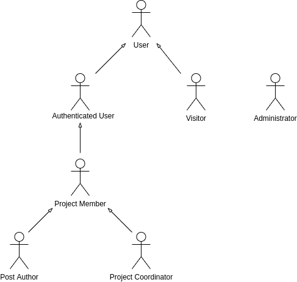
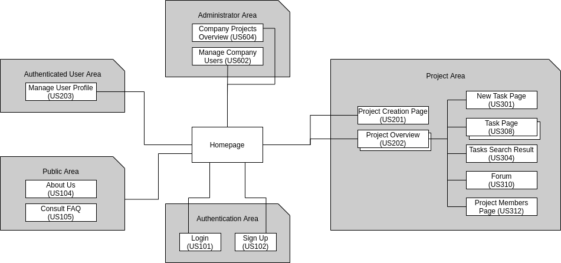
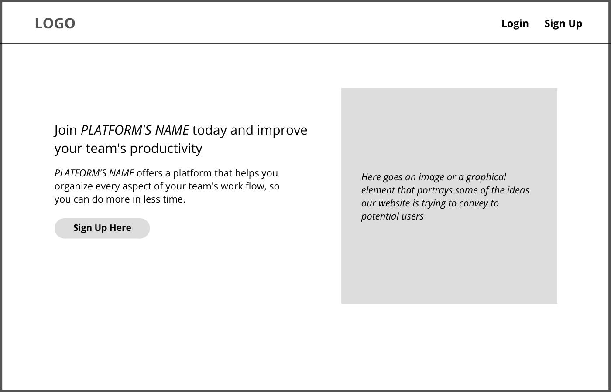
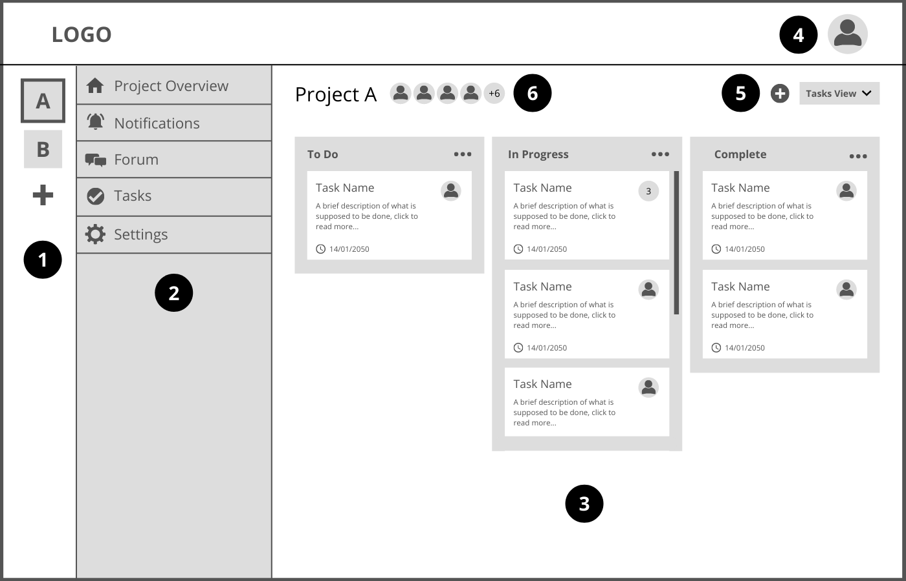
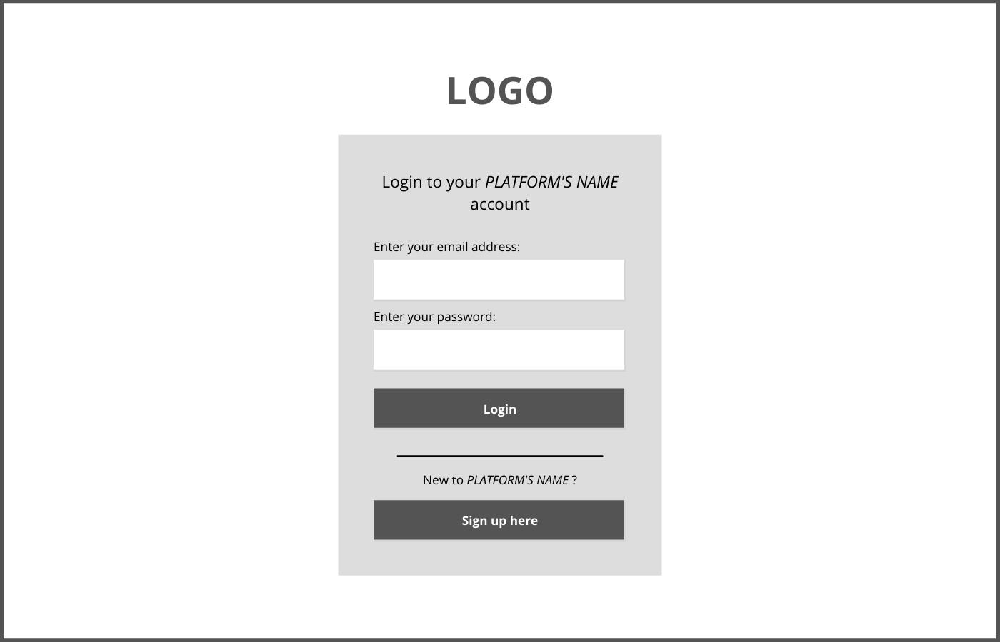
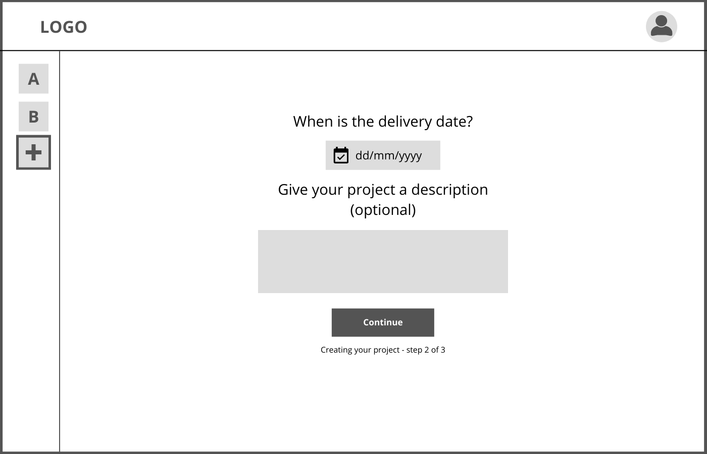
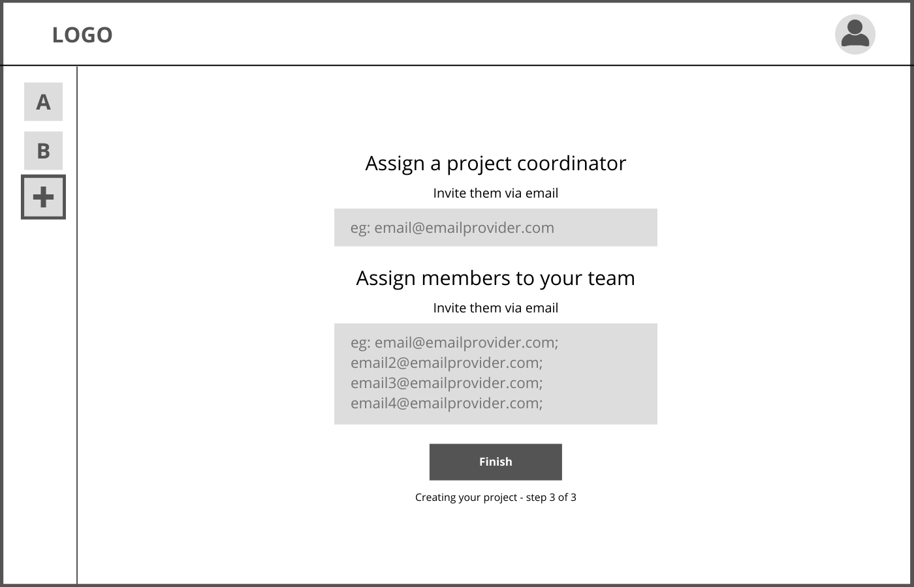
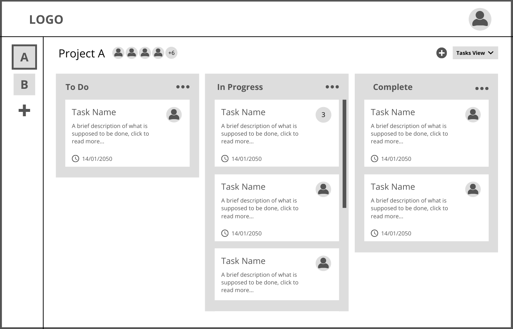
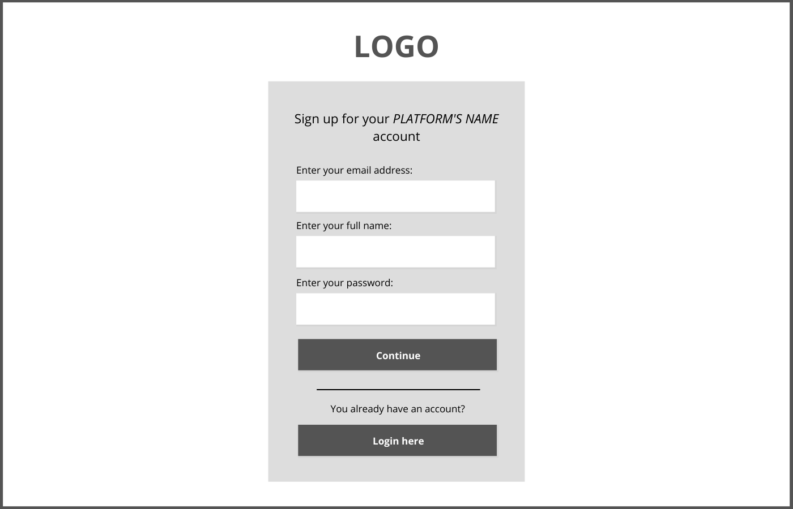

# ER: Requirements Specification Component

Delivery Date: 08/11/2021  
Editor: Miguel Azevedo Lopes (up201704590) - up201704590@fe.up.pt

## A1: Project Management

The main goal of this artefact is to describe the project, the project's stakeholders as well the motivation behind it.

### 1. Context and Motivation

This project aims to build an information system with a web interface for project management that allows teams of users to organize their professional projects. This application’s target audience are companies and teams working on complex projects, offering them a platform to organize every aspect of their workflow.

The motivation behind this project is creating an application that boosts productivity when developing a project. Helps users organize their work by providing them with a simple yet powerful interface for project management.

The application allows for each company’s users to work on multiple projects simultaneously. A project is defined by a list of tasks, the users working on that project and the timeline of completion. The application also includes a forum where users working on the same project can interact with each other.

In order to start using our application a company must first register an account. The company's system administrator can send email invitations to their workers, after which they are prompted to create an account to start using the platform or use an existing account (this accounts for the possibility that a user has used our platform before to work on a different company, but was using the same email address). From that point on, the user needs to use their credentials to access the platform.

Different user types have different permissions. The existing types are: visitors, authenticated users and the administrator. Authenticated users can also be project members, post authors and project coordinators.

Visitors are only able to authenticate themselves and view public information.

General authenticated users are able to create new and view current projects and are able to manage their projects by accepting/declining new invitations and by marking some as favorites.

Project members within a project are able to view, modify, add, delete, comment and implement tasks and assign them to other collaborators. They are also able to browse and post to the message forum and are able to search for tasks and other collaborators and managers. Whoever posts to the forum may edit and delete the post.

Project coordinators, besides having every permission a project member has, are able to moderate by adding or removing members from each project and promoting them to coordinators. They can also edit some project details and archive the project itself.

Every user within a project receives notifications when: he is invited to a project, a task is assigned to him or when there is a new message in the forum.

The Administrator is the company's representative that is responsible for managing who inside the company gets to use this platform. Besides that he can also browse through projects and read their details.

---

## A2: Actors and User stories

The main goal of this artefact is to identify and describe the system actors, as well as their user stories.

### 1. Actors

| Identifier          | Description                                                                                                                                   |
| ------------------- | --------------------------------------------------------------------------------------------------------------------------------------------- |
| Visitor             | Unauthenticated user that can sign-in into the system (login) or register (sign-up) with email invitation and has acess to public information |
| Authenticated User  | Generic user that has access to public information, can create projects and accept/decline invites                                            |
| Project Member      | Authenticated user that can manage tasks, post messages on the forum and have access to project information                                   |
| Post Author         | Authenticated user that can edit/delete their own post                                                                                        |
| Project Coordinator | Authenticated user that can edit project details and is responsible for the management of users                                               |
| Administrator       | Authenticated user that can browse and view project details                                                                                   |

### 2. User Stories

#### 2.1. Visitor

| Identifier | Name        | Priority | Description                                                                                                             |
| ---------- | ----------- | -------- | ----------------------------------------------------------------------------------------------------------------------- |
| US101      | Login       | High     | As a Visitor, I want to authenticate myself into the system, so that I can access privileged information                |
| US102      | Sign-up     | High     | As a Visitor, I want to register myself into the system, so that I can authenticate myself into the system              |
| US103      | See home    | High     | As a Visitor, I want to access the home page, so that I can see a brief presentation of the website                     |
| US104      | See about   | High     | As a Visitor, I want to access the about page, so that I can see a complete description of the website and its creators |
| US105      | Consult FAQ | High     | As a Visitor, I want to access the FAQ, so that I can get quick answers to common questions                             |

#### 2.2. Authenticated User

| Identifier | Name                       | Priority | Description                                                                                                                                                    |
| ---------- | -------------------------- | -------- | -------------------------------------------------------------------------------------------------------------------------------------------------------------- |
| US201      | Create project             | High     | As an Authenticated user, I want to create a project, so that I can work on a new project                                                                      |
| US202      | View projects              | High     | As an Authenticated user, I want to see my projects, so that I can switch between projects                                                                     |
| US203      | Manage profile             | High     | As an Authenticated user, I want to be able to manage my personal information (Name, Contact Info, Profile Picture,...), so that I can update them at any time |
| US204      | Manage project invitations | High     | As an Authenticated user, I want to be able to accept or decline invitations, so that I can participate in new projects                                        |
| US205      | Logout                     | High     | As an Authenticated user, I want to be able to logout of my account                                                                                            |
| US206      | Mark project as favorite   | Medium   | As an Authenticated user, I want to be able to mark projects as favorites, so that I can make accessing them easier                                            |
| US207      | Delete account             | Medium   | As an Authenticated user, I want to be able to delete my account, so that I can erase my personal information from the system                                  |

#### 2.3. Project Member

| Identifier | Name                           | Priority | Description                                                                                                                                   |
| ---------- | ------------------------------ | -------- | --------------------------------------------------------------------------------------------------------------------------------------------- |
| US301      | Create task                    | High     | As a Project Member, I want to create a task                                                                                                  |
| US302      | Manage tasks                   | High     | As a Project Member, I want to manage tasks (assign them to another Project member, choose the priority of each task and its due date)        |
| US303      | Complete an assigned task      | High     | As a Project Member, I want to be able to mark the tasks I am assigned to as complete                                                         |
| US304      | Search tasks                   | High     | As a Project Member, I want to be able to search for tasks using a search bar, so that I can access them faster                               |
| US305      | Leave project                  | High     | As a Project Member, I want to be able to leave the project                                                                                   |
| US306      | Assign Users to Tasks          | High     | As a Project Member, I want to be able to assign a task to another project member, so that every collaborator knows what they need to work on |
| US307      | Post messages to project forum | Medium   | As a Project Member, I want to be able to post new messages to the project forum, so that I can communicate with every collaborator           |
| US308      | View task details              | Medium   | As a Project Member, I want to be able to view task details                                                                                   |
| US309      | Comment on task                | Medium   | As a Project Member, I want to be able to comment on tasks                                                                                    |
| US310      | Browse project forum           | Medium   | As a Project Member, I want to access the project forum, so that I can read mine and other users’ messages                                    |
| US311      | Receive notifications          | Medium   | As a Project Member, I want to receive notifications, a new task has been assigned to me or when there are new messages in the forum          |
| US312      | View the project’s team        | Low      | As a Project Member, I want to be able to view the project’s team, so that I know every collaborator within the project                       |
| US313      | View Team members profile      | Low      | As a Project Member, I want to be able to view the profile of project members, so that I can correctly identify every collaborator            |

#### 2.4. Post Author

| Identifier | Name         | Priority | Description                                                                               |
| ---------- | ------------ | -------- | ----------------------------------------------------------------------------------------- |
| US401      | Edit posts   | High     | As the Post Author, I want to be able to edit my own posts, so that I can update my posts |
| US402      | Delete posts | High     | As the Post Author, I want to be able to delete my own posts                              |

#### 2.5. Project Coordinator

| Identifier | Name                       | Priority | Description                                                                                                                   |
| ---------- | -------------------------- | -------- | ----------------------------------------------------------------------------------------------------------------------------- |
| US501      | Add user to project        | High     | As the Project Coordinator, I want to be able to add an user to the project, so that they can work on that project            |
| US502      | Assign tasks to members    | High     | As the Project Coordinator, I want to be able to assign a task to a member                                                    |
| US503      | Assign new coordinator     | High     | As the Project Coordinator, I want to be able to choose another coordinator                                                   |
| US504      | Edit project details       | High     | As the Project Coordinator, I want to be able to edit project details, so that I can update the project's details             |
| US505      | Invite to Project by email | Medium   | As the Project Coordinator, I want to be able to Invite a new member by email, so that new collaborators may join the project |
| US506      | Archive project            | Medium   | As the Project Coordinator, I want to be able to archive a project, so that old projects are deactivated but not erased       |

#### 2.6. Administrator

| Identifier | Name                                     | Priority | Description                                                                                                                                                                       |
| ---------- | ---------------------------------------- | -------- | --------------------------------------------------------------------------------------------------------------------------------------------------------------------------------- |
| US601      | Invite user to the company’s workspace   | High     | As the Administrator, I want to be able to control who gets to access the company’s workspace, so that new users can access it                                                    |
| US602      | View a list of company users             | High     | As the Administrator, I want to be able to be able to view a list of all users with access to the company’s project management platform, so that I can search for specific people |
| US603      | Remove user from the company’s workplace | High     | As the Administrator I want to be able to revoke an user’s access to the company’s project management platform, so that I can moderate the platform                               |
| US604      | Browse projects                          | High     | As the Administrator I want to be able to browse projects and all its details with view only permissions, so that I'm aware of every project being worked on                      |

### 3. Supplementary Requirements

This section contains business rules, technical requirements and other non-functional requirements of the project.

#### 3.1. Business rules

| Identifier | Name                     | Priority                                                                                                                                   |
| ---------- | ------------------------ | ------------------------------------------------------------------------------------------------------------------------------------------ |
| BR01       | Administrator privileges | Administrator accounts are independent of the user accounts and cannot create or participate in projects                                   |
| BR02       | Project delivery date    | A project’s delivery date must always be posterior to its starting date                                                                    |
| BR03       | Forum Post History       | A record of all forum posts is kept for posterity (even those deleted by the Post Author)                                                  |
| BR04       | User Data Deletion       | When a user's account is deleted, every detail is kept, since it is considered work product(this includes tasks created, forum posts, etc) |
| BR05       | Dates Restrictions       | Completion/delivery dates must be posterior to the task/project's creation date.                                                           |
| BR06       | Project Coordinator      | When a user creates a project, they automatically become the project coordinator for that project                                          |
| BR07       | Edit Forum Posts         | A user can edit his own forum posts however a record of the editing is kept and made available for other users to see                      |

#### 3.2. Technical requirements

| Identifier | Name             | Priority                                                                                                                                                                                                                                                                                                         |
| ---------- | ---------------- | ---------------------------------------------------------------------------------------------------------------------------------------------------------------------------------------------------------------------------------------------------------------------------------------------------------------- |
| **TR01**   | **Availability** | **The system must be available 99 percent of the time in each 24-hour period.    If the Project Management platform isn't available at all times this could represent a serious cost for the company as it could lead to a delay in the delivery date as well as reduced productivity for its employees.** |
| TR02       | Accessibility    | The system must ensure that everyone can access the pages, regardless of whether they have any handicap or not, or the web browser they use                                                                                                                                                                      |
| **TR03**   | **Usability**    | **The system should be simple and easy to use.    One of the main motivations for this project is to offer a simple yet powerful tool for improving productivity, planning and overall workflow, so it is of utmost importance that it is easy to use.**                                                   |
| TR04       | Performance      | The system should have response times shorter than 2 s to ensure the user's attention                                                                                                                                                                                                                            |
| TR05       | Web application  | The system should be implemented as a web application with dynamic pages (HTML5, JavaScript, CSS3 and PHP).                                                                                                                                                                                                      |
| TR06       | Portability      | The server-side system should work across multiple platforms (Linux, Mac OS, etc).                                                                                                                                                                                                                               |
| TR07       | Database         | The PostgreSQL database management system must be used, with a version of 11 or higher.                                                                                                                                                                                                                          |
| **TR08**   | **Security**     | **The system shall protect information from unauthorised access through the use of an authentication and verification system.    Companies deal with all sorts of sensitive materials and therefore it is crucial that all information is protected at all times and kept safe from unauthorised users.**  |
| TR09       | Robustness       | The system must be prepared to handle and continue operating when runtime errors occur                                                                                                                                                                                                                           |
| TR10       | Scalability      | The system must be prepared to deal with the growth in the number of users and their actions                                                                                                                                                                                                                     |
| TR11       | Ethics           | The system must respect the ethical principles in software development (for example, personal user details, or usage data, should not be collected nor shared without full acknowledgement and authorization from its owner)                                                                                     |

#### 3.3. Restrictions

| Identifier | Name     | Priority                                                                   |
| ---------- | -------- | -------------------------------------------------------------------------- |
| C01        | Deadline | The platform must be developed and ready to use by the end of the semester |

---

## A3: Information Architecture

The main goals of this artefact are the following:

- Create a simple prototype for the user interface that includes key features (wireframes)
- Specify the manner in which the main pages relate to each other

### 1. Sitemap

The "Project Overview" page and the "Task Page" are represented as page stacks because a user can have multiple projects and each project can have multiple tasks. Each project and each task have a different pages.

### 2. Wireframes

#### UI01: Visitor Homepage

#### UI02: Authenticated User Homepage

- `1` In this side bar the user can switch between projects and create a new one.
- `2` When the user clicks on a project's icon this menu pops up. Here he can choose between the options displayed which will them prompt them to go to different pages.
- `3` This is the homepage/ project overview page. Here the user can see the project as a whole - all the tasks (his and other users' tasks) are displayed in one of the three dashboards: To Do, In Progress and Complete.
- `4` By clicking his profile image the user can access a drop down menu that will include a link to his user profile settings and a log out link.
- `5` The plus sign is used to create a new task.
- `6` Here is displayed the project title and the pictures of the Project Members. When the user clicks on one of them he is taken to a page where he can see the full project members list. When the user clicks on the title he is taken to a page with a full description of the project, including delivery date, project members, project coordinator, etc

### Extra

#### UI03: Login

#### UI04: New Project

#### UI05: Forum

#### UI06: Project Overview

#### UI07: Sign Up

---

## Revision history

- Updated Diagram, Project Coordinator now derives from Project Member
- Added BR06 and BR07
- Reviewed the notification policy
---

GROUP2151, 08/11/2021

| Name                  | Number    | E-Mail            |
| --------------------- | --------- | ----------------- |
| Sofia Germer          | 201907461 | up201907461@up.pt |
| Miguel Lopes (Editor) | 201704590 | up201704590@up.pt |
| Edgar Torre           | 201906573 | up201906573@up.pt |
| Henrique Pinho        | 201805000 | up201805000@up.pt |
