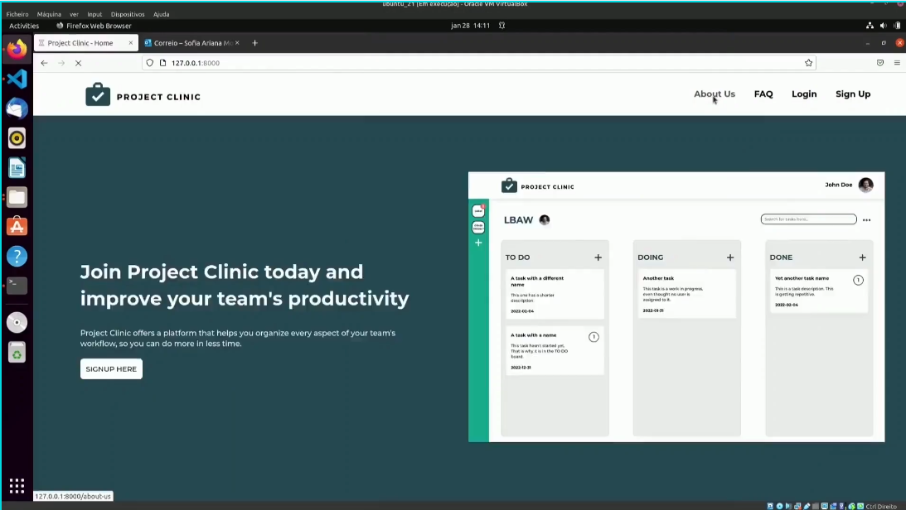

# PA: Product and Presentation

> Project vision.

## A9: Product

We developed a web application for project management which includes, task management and assignment, easier communication between project members using the project's forum, a notification system, etc. Users can use our app on both an professional environment or a personal one.

### 1. Installation


The full Docker command to start the image available at the group's GitLab Container Registry using the production database:

```
sudo docker run -it -p 8000:80 --name=lbaw2151 -e DB_DATABASE="lbaw2151" -e DB_SCHEMA="lbaw2151" -e DB_USERNAME="lbaw2151" -e DB_PASSWORD="wQTXZRMG" git.fe.up.pt:5050/lbaw/lbaw2122/lbaw2151
```

### 2. Usage

The final release version can be found [here](http://lbaw2151.lbaw.fe.up.pt).

To create an account you need to use your real email address since we've implemented a safeguard to prevent users from using accounts without verifying them. Alternatively you can use the accounts we've already set up (see below).

#### 2.1. Administration Credentials

To access the admin page just login using this credentials: 

| Username | Password |
| -------- | -------- |
| sofia@example.com    | 1234 |

#### 2.2. User Credentials

| Type          | Username  | Password |
| ------------- | --------- | -------- |
| User/Project Coordinator | john@example.com   | 1234 |
| User/Project Coordinator   | maria@example.com    | 1234 |

### 3. Application Help

We strived to create an app that is simple to use and that includes features that are self-explanatory. Besides that we made sure that some other accessability features were included. To exemplify, every input has either a placeholder or label that indicates what the field should include. 

### 4. Input Validation

Input data is always validated on the server-side, and when necessary, also on the client-side. 

One example that includes both types of validation is when the user tries to create a project: the delivery date is validated on the client-side, preventing the user from choosing a delivery date posterior to the present day. It also prevents the user from creating a task with an empty title.

### 5. Check Accessibility and Usability

Results of accessibility and usability tests using the following checklists:

- Accessibility: [Accessibility Report - SAPO UX](./Checklist%20de%20Acessibilidade%20-%20SAPO%20UX.pdf)
- Usability: [Usability Report - SAPO UX](./Checklist%20de%20Usabilidade%20-%20SAPO%20UX.pdf)

### 6. HTML & CSS Validation

The results of the validation of the HTML and CSS code:

- HTML:[W3C HTML Validator Reports](./HTMLValidation)
- CSS: [W3C CSS Validator Report](./W3C%20CSS%20Validator%20results.pdf)

### 7. Revisions to the Project

No structural changes were made to the project. That being said, some changes were made in the database to accommodate Laravel's functional requirements, such as:

- Creating a table for password resetting using Laravel's built-in functions
- Adding a row to the User's table to allow for email verification
- Adding deleted_at rows to tables where we use Laravel's Soft Delete function
- After discussing with the teacher we decided to remove Administration table from the database. Administrators are now identified by a flag in the Users table 

### 8. Implementation Details

#### 8.1. Libraries Used

The only library we used was **FontAwesome**, to use icons in our project. Documentation can be found [here](https://fontawesome.com/v5.15/how-to-use/on-the-web/referencing-icons/basic-use).

#### 8.2 User Stories


| US Identifier | Name    | Module | Priority                       | Team Members               | State  |
| ------------- | ------- | ------ | ------------------------------ | -------------------------- | ------ |
| US101      | Login      | M01 | High     | Sofia Germer | 100% |
| US102      | Sign-up     | M02 | High     | Sofia Germer | 100% |
| US103      | See home    | M01 | High     | Miguel Lopes | 100% |
| US104      | See about   | M01 | High     | Sofia Germer | 100% |
| US105      | Consult FAQ | M01 | High     | Henrique Pinho | 100% |
| US201      | Create project       | M04   | High     | Henrique Pinho | 100% |
| US202      | View projects             | M04 | High     | Miguel Lopes | 100% |
| US203      | Manage profile          | M03   | High     | Sofia Germer | 100%|
| US204      | Manage project invitations | M03 | High     | Miguel Lopes | 100% |
| US205      | Logout                    | M03 | High     | Sofia Germer | 100% |
| US206      | Mark project as favorite  | M04 | Medium   | Miguel Lopes | 100% |
| US207      | Delete account            | M02 | Medium   | Miguel Lopes | 100% |
| US301      | Create task                | M04    | High     |  Miguel Lopes | 100%|
| US302      | Manage tasks                | M04  | High     |  Miguel Lopes | 100%|
| US303      | Complete an assigned task   | M04   | High     |  Miguel Lopes | 100%|
| US304      | Search tasks               | M04   | High     |  Miguel Lopes | 100%|
| US305      | Leave project               | M04   | High     | Miguel Lopes | 100% |
| US306      | Assign Users to Tasks       | M04  | High     | Miguel Lopes | 100% |
| US307      | Post messages to project forum | M05 | Medium   | Edgar Torre | 100% |
| US308      | View task details            | M04 | Medium   | Miguel Lopes | 100% |
| US309      | Comment on task              | M04  | Medium   | Miguel Lopes | 100% |
| US310      | Browse project forum         | M05 | Medium   | Edgar Torre | 100% |
| US311      | Receive notifications        | M04  | Medium   | Miguel Lopes | 100% |
| US312      | View the project’s team      | M04 | Low      |  Miguel Lopes | 100% |
| US313      | View Team members profile    | M04 | Low      | Sofia Germer | 100% |
| US401      | Edit posts  | M05 | High     | Miguel Lopes | 100% |
| US402      | Delete posts | M05 | High     | Miguel Lopes | 100% |
| US501      | Add user to project      | M04  | High     | Miguel Lopes | 100% |
| US502      | Assign tasks to members  | M04  | High     | Miguel Lopes | 100% |
| US503      | Assign new coordinator   | M04  | High     | Miguel Lopes | 100% |
| US504      | Edit project details      | M04 | Medium     |  | 0% |
| US505      | Invite to Project by email | M04 |Medium   | Miguel Lopes | 100% |
| US506      | Archive project            | M04 | Medium   | Miguel Lopes | 100% |
| US601      | Invite user to the company’s workspace | M06  | High | Sofia Germer, Miguel Lopes | 100% |
| US602      | View a list of company users          | M06 | High     | Sofia Germer | 100% |
| US603      | Remove user from the company’s workplace| M06 | High     | Sofia Germer | 100% |
| US604      | Browse projects                     | M06     | High     | Sofia Germer | 100% | 


## A10: Presentation
 

### 1. Product presentation

We developed a web application for project management which includes, task management and assignment, easier communication between project members using the project's forum, a notification system, etc. Users can use our app on both an professional environment or a personal one.

URL to the product: http://lbaw2151.lbaw.fe.up.pt  


### 2. Video presentation

Screenshot of the video :



Link to video: 
https://drive.google.com/file/d/1HfiZMB7RLNwMIv1D4tYm0mDPD5RXv0Qk/view?usp=sharing

---


## Revision history

***

GROUP2151, 21/01/2022

| Name                  | Number    | E-Mail            |
| --------------------- | --------- | ----------------- |
| Sofia Germer          | 201907461 | up201907461@up.pt |
| Miguel Lopes (Editor) | 201704590 | up201704590@up.pt |
| Edgar Torre           | 201906573 | up201906573@up.pt |
| Henrique Pinho        | 201805000 | up201805000@up.pt |
