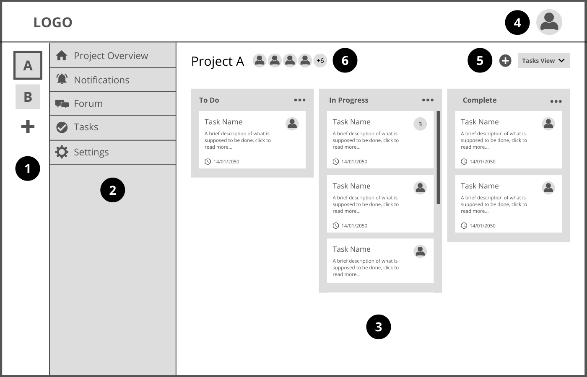
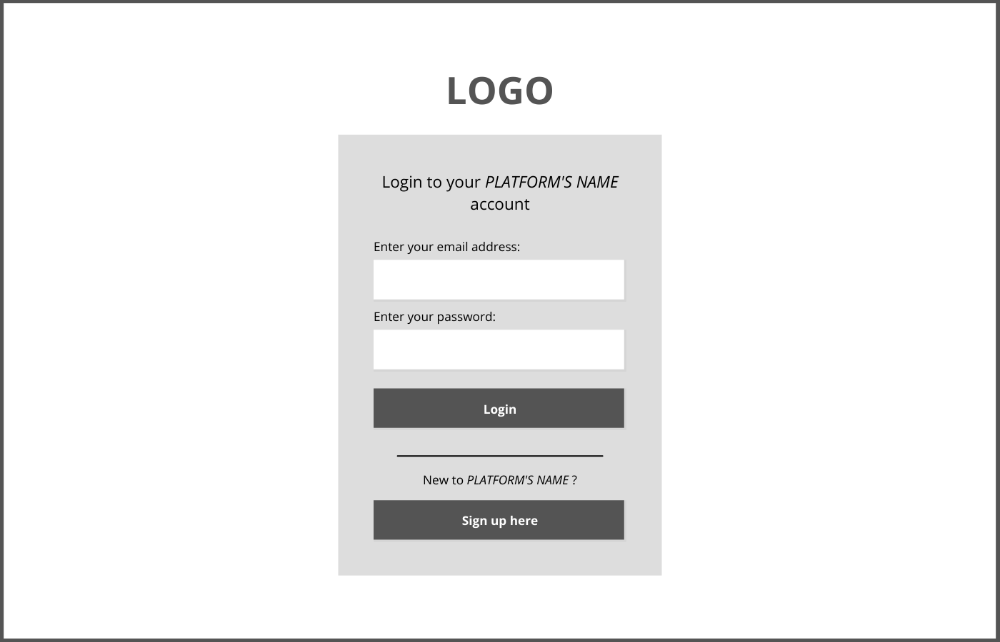
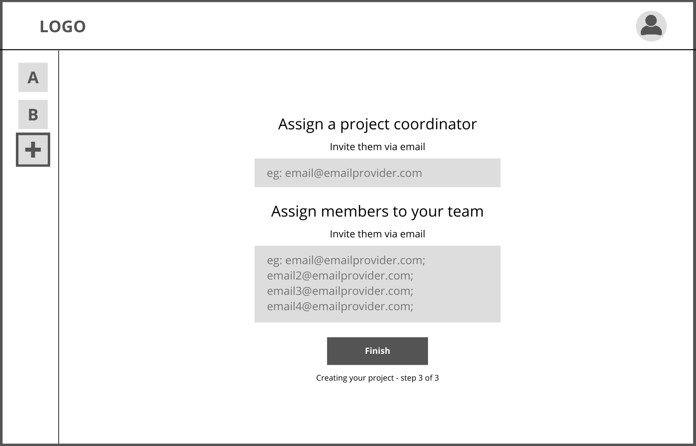
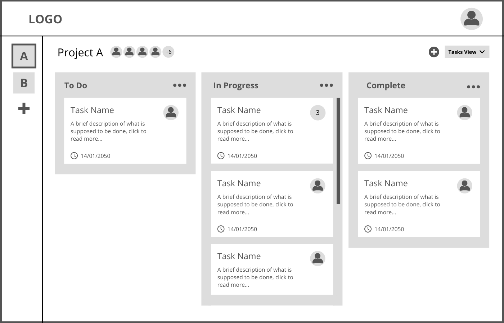

# Project Managment ActorsER: Requirements Specification Component

> Project vision.

## A1: Project Management

> Goals, business context and environment.  
> Motivation.  
> Main features.  
> User profiles.

This project aims to build an information system with a web interface for project management that allows teams of users to organize their professional projects. This application’s target audience are companies and teams working on complex projects, offering them a platform to organize every aspect of their work flow.

The motivation behind this project is creating an application that boosts productivity when developing a project. Helps users organize their work by providing them with a simple yet powerful interface for project management.

The application allows for each company’s users to work on multiple projects simultaneously. A project is defined by a list of tasks, the users working on that project and the timeline of completion. The application also includes a forum where users working on the same project can interact with each other.

In order to start using our application a company must first register an account. The company's system administrator can send email invitations to their workers, after which they are prompted to create an account to start using the platform or use an existing account (this accounts for the possibility that a user has used our platform before to work on a different company, but was using the same email address). From that point on, the user needs to use their credentials to access the platform. 

Different user types have different permissions. The existing types are: guests and authenticated users, which includes general, project members and administrators.

Guests are only able to authenticate themselves.

General authenticated users are able to create new and view current projects and are able to manage their projects by accepting/declining new invitations and by marking some as favorites.

Project members within a project are able to view, modify, add, delete, comment and implement tasks and assign them to other collaborators. They are also able to browse and post to the message forum and are able to search for tasks and other collaborators and managers. Whoever posts to the forum may edit and delete the post.

Project managers, besides having every permission a project member has, are able to moderate by adding or removing members from each project and promoting them to managers. They can also edit some project details and archive the project itself.

Every user within a project receives notifications when: a new member joins the project, a user is promoted/demoted, a task is assigned to him and when an assigned task is completed if the user is a project manager or if he’s assigned to that task. 

Administrator may browse for a project and read its details.

---

## A2: Actors and User stories

> Brief presentation of the artefact goals.

### 1. Actors

> Diagram identifying actors and their relationships.  
> Table identifying actors, including a brief description.

| Identifier       | Description            | 
| ---------------- | ---------------------- | 
| User          |  Unauthenticated user that can sign-in in the system or register (sign-up) with email invitation and has acess to public information                      | 
| Authenticated User | Generic user that has access to public information, can create projects and accept/decline invites |
| Project Member  | Authenticated user that can manage tasks, post messages on the forum and have access to project information                       | 
| Post Author	  |Authenticated user that can edit/delete their own post |
| Project Coordinator  | Authenticated user that can edit project details and is responsible for the management of users | 
| Administrator    | Authenticated user that can browse and view project details |

### 2. User Stories

> User stories organized by actor.  
> For each actor, a table containing a line for each user story, and for each user story: an identifier, a name, a priority, and a description (following the recommended pattern).

#### 2.1. User

| Identifier       | Name                   | Priority               | Description              |
| ---------------- | ---------------------- | ---------------------- |------------------------- |        
| US101             | Login                |  High                  | As a Visitor, I want to authenticate into the system, so that I can access privileged information                       |
| US102             | Sign-up                |  High                  |  As a Visitor, I want to register myself into the system, so that I can authenticate myself into the system              |       
| US103             | Manage invite          | High                   | As a User, I want to accept/decline invites to a project, so I can decide which projects I want to work on|
| US104             | See home               | High                   | As a User, I want to access the home page, so that I can see a brief presentation of the website                     |
| US105             | See about              | High                   | As a User, I want to access the about page, so that I can see a complete description of the website and its creators |
| US106             | Consult FAQ            | High                   | As a User, I want to access the FAQ, so that I can get quick answers to common questions                             |

#### 2.3. Authenticated User

| Identifier       | Name                   | Priority               | Description              |
| ---------------- | ---------------------- | ---------------------- |------------------------- |        
| US201             | Create project         |  High                 | As an Authenticated user, I want to create a project, so that I can work on a new project                         |
| US202             | View projects          | High                   | As an Authenticated user, I want to see my projects, so that I can switch between projects                         |
| US203             | Manage profile      |  High      | As an Authenticated user, I want to be able to manage my personal information (Name, Contact Info, Profile Picture,...), so that I can see if there are any errors |
| US204             | Manage project invitations | High              |  As an Authenticated user, I want to be able to accept or decline invitations, so that I can participate in new projects               |
| US205             | Mark project as favorite | Medium           |   As an Authenticated user, I want to be able to mark projects as favorites, so that I can filter them    |
| US206             | Logout       | High           |   As an Authenticated user, I want to be able to logout of my account|
#### 2.4. Project Member

| Identifier       | Name                   | Priority               | Description              |
| ---------------- | ---------------------- | ---------------------- |------------------------- |        
| US301             | Create task            | High                   | As a Project Member, I want to create a task, so that I'm able to use that feature |
| US302             | Manage tasks           | High          |   As a Project Member, I want to manage tasks, (so that I can assign them to another Project member), choose the priority of each task and its due date, so that I can fix mistakes and update older tasks|
| US303             | Complete an assigned task |  High     | As a Project Member, I want to be able to mark the tasks I am assigned to as complete, so that other collaborators don't overlap my work |
| US304             | Search tasks           |  High                  | As a Project Member, I want to be able to search for tasks using a search bar, so that I can access them faster |
| US305             | Leave project          | High |As a Project Member, I want to be able to leave the project, so that my project list is updated|
| US306             | Assign Users to Tasks  | High |As a Project Member, I want to be able to assign a task to another project member, so that every collaborator knows what's left to do |
| US307             | Post messages to project forum | Medium | As a Project Member, I want to be able to post new messages to the project forum, so that I can communicate with every collaborator|
| US308             | View task details      |Medium |As a Project Member, I want to be able to view task details, so that I know more about it|
| US309             | Comment on task        |Medium |As a Project Member, I want to be able to comment on tasks, so that I can communicate with other collaborators |
| US310             | Browse project forum   | Medium  | As a Project Member, I want to access the project forum, so that I can read mine and other users’ messages |
| US311        | Receive notifications          | Medium   | As a Project Member, I want to receive notifications, so that I can keep up to date on changes like new Project Coordinator, task completed, new member on project or a new task has been assigned to me |
| US312             | View the project’s team|Low(?)|As a Project Member, I want to be able to view the project’s team, so that I know every collaborator within the project|
| US313             | View Team members profile|low (?)|As a Project Member, I want to be able to view the profile of project members, so that I can correctly identify every collaborator|

#### 2.5. Post Author

| Identifier       | Name                   | Priority               | Description              |
| ---------------- | ---------------------- | ---------------------- |------------------------- |        
| US401             |Edit posts|High|As the Post Author, I want to be able to edit my own posts, so that I can fix previous mistakes or update my posts|
| US402             |Delete posts|High|As the Post Author, I want to be able to delete my own posts, so that the message forum isn't full of obsolete posts|

#### 2.6. Project Coordinator

| Identifier       | Name                   | Priority               | Description              |
| ---------------- | ---------------------- | ---------------------- |------------------------- |
| US501           |Add user to project|High|As the Project Coordinator, I want to be able to add an user to the project, so that new collaborators gain their new permissions|
| US502           |Assign tasks to members|High|As the Project Coordinator, I want to be able to assign a task to a member, so that every collaborator has a task or list of tasks to do|
| US503           |Assign new coordinator|High|As the Project Coordinator, I want to be able to choose another coordinator, so that new project coordinators gain their new permissions|
| US504           |Edit project details|High|As the Project Coordinator, I want to be able to edit project details, so that I can fix old errors and update the objective of the project|
| US506           |Invite to Project by email|High|As the Project Coordinator, I want to be able to Invite a new member by email, so that new collaborators may join the project|
| US507           |Archive project|Medium|As the Project Coordinator, I want to be able to archive a project, so that old projects are deactivated but not erased|

#### 2.7. Administrator

| Identifier       | Name                   | Priority               | Description              |
| ---------------- | ---------------------- | ---------------------- |------------------------- |
|US601             |Invite user to the company’s workspace|High|As the Administrator, I want to be able to control who gets to access the company’s workspace, so that new users can access it|
|US602              |View a list of company users|High|As the Administrator, I want to be able to be able to view a list of all users with access to the company’s project management platform, so that I can search for specific people|
|US603              |Remove user from the company’s workplace|High|As the Administrator I want to be able to revoke an user’s access to the company’s project management platform, so that I can moderate the platform|
|US604              |Browse projects|High|As the Administrator I want to be able to browse projects and all its details with view only permissions, so that I'm aware of every project being worked on |

### 3. Supplementary Requirements

This section contains business rules, technical requirements and other non-functional requirements on the project.

#### 3.1. Business rules

| Identifier       | Name                   | Priority               | 
| ---------------- | ---------------------- | ---------------------- |        
| BR01             | Administrator privileges |  Administrator accounts are independent of the user accounts and cannot create or participate in projects | 
| BR02             | Project delivery date  | A project’s delivery date must always be posterior to its starting date |                          
| BR03             | Forum Post History |A record of all forum posts is kept for posterity (even those deleted by the Post Author)|                          

#### 3.2. Technical requirements

| Identifier       | Name                   | Priority               | 
| ---------------- | ---------------------- | ---------------------- |        
| TR01             | Availability|The system must be available 99 percent of the time in each 24-hour period| 
| TR02             | Accessibility|The system must ensure that everyone can access the pages, regardless of whether they have any handicap or not, or the web browser they use|        
| TR03             | Usability|The system should be simple and easy to use. The MediaLibrary system is designed to be used by media consumers from all ages, with or without technical experience, so a very good usability is a critical requirement.|
| TR04             | Performance|The system should have response times shorter than 2 s to ensure the user's attention|
| TR05             | Web application|The system should be implemented as a web application with dynamic pages (HTML5, JavaScript, CSS3 and PHP).It is critical that the MediaLibrary system is easily accessible from anywhere without the need to install specific applications or software, adopting standard web technologies.|
| TR06             | Portability|The server-side system should work across multiple platforms (Linux, Mac OS, etc.).The MediaLibrary system is destined for personal use. To make it easily available to a large user base, it should be platform-independent.|
| TR07             | Database|The PostgreSQL database management system must be used, with a version of 11 or higher.|
| TR08             | Security|The system shall protect information from unauthorised access through the use of an authentication and verification system|
| TR09             | Robustness|The system must be prepared to handle and continue operating when runtime errors occur|
| TR10             | Scalability|The system must be prepared to deal with the growth in the number of users and their actions|
| TR11             | Ethics|The system must respect the ethical principles in software development (for example, personal user details, or usage data, should not be collected nor shared without full acknowledgement and authorization from its owner)|

#### 3.3. Restrictions

| Identifier       | Name                   | Priority               | 
| ---------------- | ---------------------- | ---------------------- |        
| C01              |   Deadline             | The platform must be developed and ready to use by the end of the semester | 

---

## A3: Information Architecture

> Brief presentation of the artefact goals.

### 1. Sitemap

> Sitemap presenting the overall structure of the web application.  
> Each page must be identified in the sitemap.  
> Multiple instances of the same page (e.g. student profile in SIGARRA) are presented as page stacks.

### 2. Wireframes

> Wireframes for, at least, two main pages of the web application.
> Do not include trivial use cases.

#### UI01: User Homepage

#### UI02: Authenticated User Homepage

- `1` In this side bar the user can switch between projects and create a new one.
- `2` When the user clicks on a project's icon this menu pops up. Here he can choose between the options displayed which will them prompt them to go to  different pages.
- `3` This is the homepage/ project overview page. Here the user can see the project as a whole - all the tasks (his and other users' tasks) are displayed in one of the three dashboards: To Do, In Progress and Complete.
- `4` By clicking his profile image the user can access a drop down menu that will include a link to his user profile settings and a log out link.
- `5` The plus sign is used to create a new task.
- `6` Here is displayed the project title and the pictures of the Project Members. When the user clicks on one of them he is taken to a page where he can see the full project members list. When the user clicks on the title he is taken to a page with a full description of the project, including delivery date, project members, project coordinator, etc

#### Extra
> Login

> New Project

> Forum

> Project Overview

> Sign Up

---

## Revision history

Changes made to the first submission:
1. Item 1
1. ...

***
GROUP2151, 26/10/2021

| Name             | Number    | E-Mail               |
| ---------------- | --------- | -------------------- |
| Sofia Germer     | 201907461 | up201907461@up.pt    |
| Miguel Lopes     | 20170459  | up201704590@up.pt    |
| Edgar Torre      | 201906573 | up201906573@up.pt    |
| Henrique Pinho   | 201805000 | up201805000@up.pt    |
